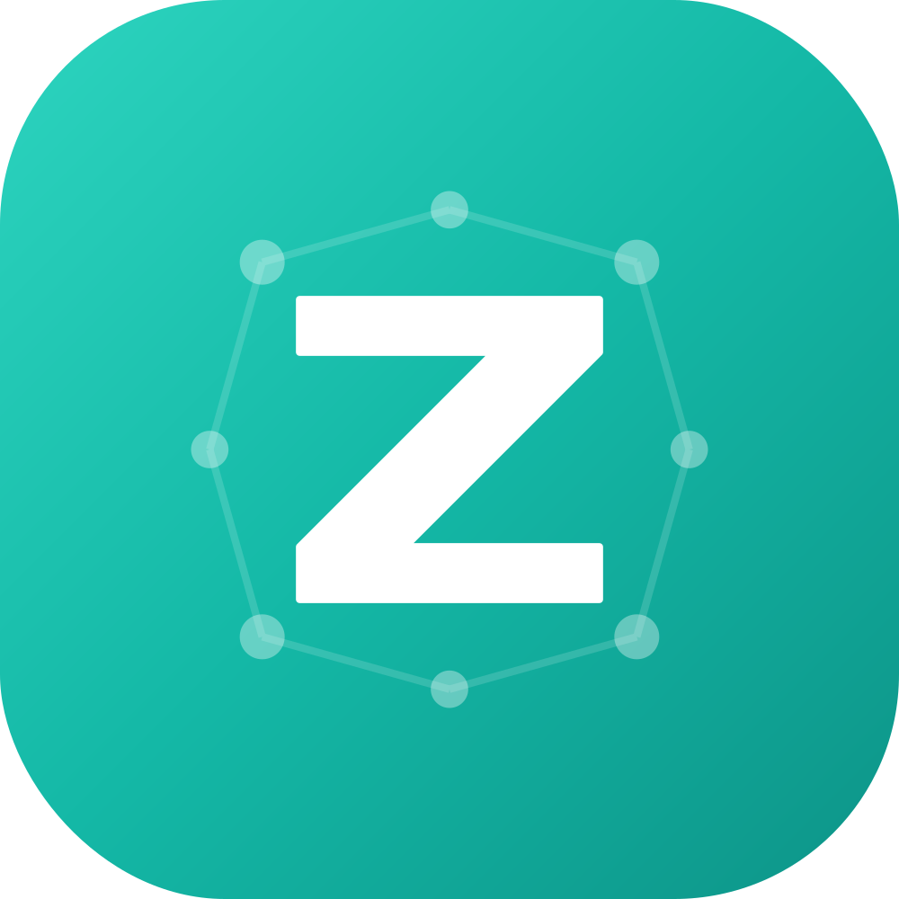

<p align="center">
  
</p>

<h1 align="center">Zedi</h1>

<p align="center">
  <strong>Zero-Friction Knowledge Network</strong><br />
  思考を宇宙のように拡張する、AIネイティブなナレッジアプリ
</p>

<p align="center">
  <a href="#features">Features</a> •
  <a href="#demo">Demo</a> •
  <a href="#getting-started">Getting Started</a> •
  <a href="#tech-stack">Tech Stack</a> •
  <a href="#roadmap">Roadmap</a> •
  <a href="#contributing">Contributing</a>
</p>

<p align="center">
  
  
  
</p>

---

## 🌟 Overview

**Zedi** は、「書くストレス」と「整理する義務」からあなたを解放するナレッジアプリです。

従来のメモアプリでは、情報をフォルダに分類し、手動でリンクを作成する必要がありました。Zedi は AI による足場生成（Scaffolding）と WikiLink によるネットワーク構造で、思考を自然に拡張させます。

### 💡 デザイン原則

- **Speed & Flow** — 起動0秒、保存不要。思考の速度で書ける
- **Context over Folder** — フォルダ不要。時間とリンクで自然に整理
- **Atomic & Constraint** — 1ページ1アイデア。小さく繋げる
- **Scaffolding by AI** — AIが知識の足場を自動生成
- **Dormant Seeds** — 未整理のメモも「発芽待ちの種」として許容

---

## ✨ Features

### 📅 Date Grid
日付ごとにグループ化されたページをグリッド表示。「いつ何を書いたか」が一目瞭然。

### 🔗 WikiLinks
`[[ページタイトル]]` 記法で簡単にページ間リンク。オートコンプリート付きで既存ページにすばやくアクセス。

### 🤖 AI Wiki Generator
キーワードを選択して AI に解説を生成させると、関連トピックへのリンクも自動挿入。知識のネットワークが自動的に広がります。

### 🌐 Web Clipper
URL を入力するだけで Web ページの本文を自動抽出。あとから自分のペースでキーワードをリンク化できます。

### 🔍 Global Search
`Cmd+K` / `Ctrl+K` で全文検索を起動。キーワードを含むページを瞬時に発見。

### 🔀 Linked Pages
ページ下部に関連ページを自動表示：
- **Outgoing Links** — このページからリンクしている先
- **Backlinks** — このページにリンクしている元
- **2-hop Links** — リンク先のリンク先まで辿れる

### ⌨️ Keyboard Shortcuts
- `Cmd/Ctrl + K` — グローバル検索
- `Cmd/Ctrl + N` — 新規ページ作成
- `Cmd/Ctrl + H` — ホーム画面へ
- `Cmd/Ctrl + /` — ショートカット一覧

### 📝 Markdown Editor
Tiptap ベースのリッチエディタ。Markdown ショートカットでシームレスに書ける。
- `# ` → 見出し
- `- ` → 箇条書き
- `> ` → 引用
- `**text**` → 太字
- ``` ` ``` → コードブロック

---

## 🎬 Demo

> 🚧 **Coming Soon** — スクリーンショットとデモ動画を準備中です

<!--


-->

---

## 🚀 Getting Started

### 前提条件

- [Bun](https://bun.sh/) v1.0 以上（推奨）
- または [Node.js](https://nodejs.org/) v18 以上

### インストール

```bash
# リポジトリをクローン
git clone https://github.com/your-username/zedi.git
cd zedi

# 依存関係をインストール
bun install

# 開発サーバーを起動
bun run dev
```

ブラウザで http://localhost:30000 を開いてください（デフォルトポート）。

### ポート設定

複数のアプリを並列で開発する場合、ポートを変更できます：

```bash
# 方法1: 環境変数で指定
VITE_PORT=30001 bun run dev

# 方法2: .env.local ファイルを作成
echo "VITE_PORT=30001" > .env.local
bun run dev
```

ポートが使用中の場合は、自動的に次の利用可能なポートが使用されます。

### Dockerを使った並列開発（オプション）

複数のアプリケーションインスタンスを並列で開発する場合、Dockerを使用できます：

```bash
# Dockerイメージをビルド
bun run docker:build

# すべてのインスタンスを起動（3つ同時に起動）
bun run docker:up

# バックグラウンドで起動
bun run docker:up:d

# 停止
bun run docker:down

# ログを確認
bun run docker:logs
```

起動後、以下のURLでアクセスできます：
- インスタンス1: http://localhost:30000
- インスタンス2: http://localhost:30001
- インスタンス3: http://localhost:30002

詳細は [Docker並列開発ガイド](./docs/guides/docker-parallel-development.md) を参照してください。

> **Note:** Dockerを使う場合、最低8GBのRAM（推奨: 16GB以上）が必要です。軽量な並列開発が必要な場合は、環境変数によるポート設定の方が適しています。

### 環境変数の設定（オプション）

AI 機能や認証機能を使用する場合は、`.env.local` ファイルを作成してください：

```bash
# Cognito 認証（Google/GitHub OAuth）
VITE_COGNITO_DOMAIN=your-user-pool-domain.auth.region.amazoncognito.com
VITE_COGNITO_CLIENT_ID=your-app-client-id

# Turso データベース（オプション - ローカル SQLite でも動作します）
# 認証は Cognito の JWT トークンを使用するため、VITE_TURSO_AUTH_TOKEN は不要です
VITE_TURSO_DATABASE_URL=libsql://your-database-name.aws-ap-northeast-1.turso.io
```

> **Note:** 環境変数なしでもローカル SQLite で動作します。AI 機能は設定画面から API キーを入力して使用できます。

### トラブルシューティング

本番環境でクラウド同期が失敗する場合（CORSエラーや401エラー）は、[トラブルシューティングガイド](./docs/troubleshooting/turso-sync-errors.md)を参照してください。

---

## 🛠 Tech Stack

| Category | Technology |
|----------|-----------|
| **Frontend** | React 18 + TypeScript |
| **Build Tool** | Vite |
| **Editor** | Tiptap (ProseMirror) |
| **Styling** | Tailwind CSS + shadcn/ui |
| **State** | Zustand + TanStack Query |
| **Auth** | Clerk |
| **Database** | libsql (in-memory + IndexedDB) / Turso |
| **AI** | OpenAI / Anthropic / Google Gemini |
| **Testing** | Vitest + Playwright |

---

## 🗺 Roadmap

### ✅ 完了

- [x] React + Vite 基盤構築
- [x] ページの CRUD 操作
- [x] Date Grid UI
- [x] WikiLink 機能（サジェスト付き）
- [x] AI Wiki Generator
- [x] Web Clipper
- [x] Global Search
- [x] キーボードショートカット
- [x] Clerk 認証連携
- [x] Markdown エクスポート
- [x] Backlinks / 2-hop Links 表示
- [x] Linked Pages カード表示

### 🔄 開発中

- [ ] Turso リアルタイム同期

### 📋 予定

- [ ] Tauri 2.0 デスクトップアプリ
- [ ] iOS / Android モバイルアプリ
- [ ] Share Sheet 連携
- [ ] Magic Split / Flick-to-Split
- [ ] Ghost Link System
- [ ] Semantic Search（ベクトル検索）

詳細は [PRD](docs/PRD.md) を参照してください。

---

## 🧪 Testing

```bash
# ユニットテスト
bun run test

# E2E テスト
bun run test:e2e

# テストカバレッジ
bun run test:coverage
```

---

## 📁 Project Structure

```
src/
├── components/          # React コンポーネント
│   ├── editor/          # エディタ関連
│   ├── page/            # ページ表示関連
│   ├── search/          # 検索関連
│   ├── layout/          # レイアウト
│   └── ui/              # shadcn/ui コンポーネント
├── hooks/               # カスタムフック
├── lib/                 # ユーティリティ
├── pages/               # ページコンポーネント
├── stores/              # Zustand ストア
└── types/               # TypeScript 型定義
```

---

## 🤝 Contributing

コントリビューションを歓迎します！

1. このリポジトリをフォーク
2. `develop`ブランチから機能ブランチを作成 (`git checkout -b feature/amazing-feature`)
3. 変更をコミット (`git commit -m 'feat: add amazing feature'`)
4. ブランチをプッシュ (`git push origin feature/amazing-feature`)
5. `develop`ブランチに対して Pull Request を作成

詳細は [CONTRIBUTING.md](CONTRIBUTING.md) と [ブランチ戦略ガイド](docs/guides/branch-strategy.md) を参照してください。

---

## 📄 License

このプロジェクトは MIT ライセンスの下で公開されています。詳細は [LICENSE](LICENSE) ファイルを参照してください。

---

## 🙏 Acknowledgments

- [Tiptap](https://tiptap.dev/) — 素晴らしいエディタフレームワーク
- [shadcn/ui](https://ui.shadcn.com/) — 美しい UI コンポーネント
- [Amazon Cognito](https://aws.amazon.com/cognito/) — 認証（Google/GitHub OAuth）
- [Turso](https://turso.tech/) — エッジ対応データベース

---

<p align="center">
  Made with ❤️ by the Zedi Team
</p>
