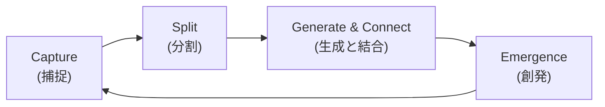

# Product Requirements Document (PRD): Zedi

| 項目             | 内容                                                                                                                                                                                      |
| :--------------- | :---------------------------------------------------------------------------------------------------------------------------------------------------------------------------------------- |
| **Product Name** | **Zedi**                                                                                                                                                                                  |
| **Platform**     | Desktop (Windows, macOS, Linux), Mobile (iOS, Android)                                                                                                                                    |
| **Core Concept** | **"Zero-Friction Knowledge Network"**<br>「書くストレス」と「整理する義務」からの解放。<br>AI による足場（Scaffolding）生成と、自然発生的なリンク構造により、思考を宇宙のように拡張する。 |
| **Target User**  | 思考のネットワーク化を重視しつつも、記述コストを極限まで下げたいアーキテクト、研究者、高度ナレッジワーカー。                                                                              |

---

## 0. 開発戦略 (Development Strategy)

### 0.1 段階的リリース方針

本プロジェクトは以下の段階でリリースを進める：

| Phase       | 形態                              | 目的                                          | 状態          |
| :---------- | :-------------------------------- | :-------------------------------------------- | :------------ |
| **Phase A** | **Web App (React + Vite)**        | UI/UX の高速な検証とコア機能の実装            | 🔄 **開発中** |
| **Phase B** | **Desktop App (Tauri 2.0)**       | Rust バックエンドによる高速化、オフライン対応 | ⏳ 予定       |
| **Phase C** | **Mobile App (Tauri 2.0 Mobile)** | iOS/Android 対応、Share Sheet 統合            | ⏳ 予定       |

### 0.2 現在の開発フェーズ: Web App

現在は **Phase A（Web App）** として開発を進めている。主な理由：

1. **高速なイテレーション:** ブラウザ上での即座な動作確認が可能
2. **UI/UX の検証:** エディタ、Date Grid、リンク機能等のコア体験を先行して磨く
3. **技術的負債の最小化:** Tauri 移行時に React コンポーネントをそのまま再利用可能

### 0.3 Tauri 移行計画

Web App で以下の機能が安定したタイミングで Tauri 2.0 への移行を開始：

- ✅ ページの CRUD 操作
- ✅ Date Grid UI
- ✅ WikiLink 機能
- ⏳ AI 機能（Wiki Generator、API キー設定）
- ⏳ Web Clipping 機能
- ⏳ Global Search

移行時の作業：

1. `npm create tauri-app` で Tauri プロジェクト初期化
2. 既存 React コードを `src/` にそのまま配置
3. Rust バックエンド機能（全文検索、Aho-Corasick）を追加実装
4. ローカル Turso (libSQL) への接続を Tauri コマンド経由に変更

---

## 1. 製品ビジョンと体験 (UX Philosophy)

### 1.1 デザイン原則

1. **Speed & Flow (思考の速度):**

   - 起動は 0 秒を目指す。思考を妨げる「保存」「同期待ち」「整理」の手間を排除する。
   - 入力までのタップ数・キーストロークを最小化する。

2. **Context over Folder (文脈による整理):**

   - フォルダによる階層化を行わない。情報は「時間（いつ生まれたか）」と「リンク（何に関連するか）」によってのみ整理される。

3. **Atomic & Constraint (原子性と制約):**

   - 1 つのメモは 1 つのアイデア（ページ）に限定する。
   - 長文を書くのではなく、小さなページをリンクで繋ぐことを推奨する UI。

4. **Scaffolding by AI (足場としての AI):**

   - ユーザーに白紙の恐怖を与えない。
   - AI は「正解」を書くためではなく、ユーザーがリンクを繋げるための「点（ノード）」を瞬時に生み出す役割を担う。

5. **Dormant Seeds (死蔵の許容):**

   - リンクされていないメモは「ゴミ」ではなく「発芽待ちの種」。
   - 無理に整理させず、将来的なネットワーク接続（Emergent Linking）を待つ。

6. **Offline-First & Real-time Sync (完全な所有):**
   - 基本的にはオフラインがメインで動作し、オンライン接続時に Turso のリアルタイム同期により複数デバイス間で自動的に変更が反映される。

### 1.2 主要なユーザーフロー (The Neural Loop)



1. **Capture (捕捉):**

   - **Desktop:** ホットキー一発（例: `Alt+Space`）で即座にページエディタへ遷移。または Web Clipper 拡張機能で Web ページを直接取り込み。
   - **Mobile:** アプリ起動時の「Date Grid」で即座に入力、または OS 標準の共有機能（Share Sheet）からブラウザ等の情報を直接ページとして放り込む。

2. **Split (分割):**

   - **Mobile:** 段落を「右フリック」(Flick-to-Split) して切り出し、即座に独立したページへ変換。
   - **Desktop:** テキストブロックをドラッグして別パネルへ (Magic Split)。
   - **Result:** どちらも AI が文脈を読み、適切なタイトルを自動付与して保存。

3. **Generate & Connect (生成と結合):**

   - 未知の概念や、体系化したいキーワードを選択し「Wiki Generate」を実行。
   - AI が解説と共に「関連するキーワードへの空リンク」を含んだ状態でテキストを生成。
   - ユーザーはこの「AI が作った足場」を飛び石のように使い、自分の思考を追記・接続していく。

4. **Emergence (創発):**
   - `[[未作成のリンク]]` が複数のページに登場した瞬間、システムがそれを「重要なトピック」と認識し、実体のあるページとして自動生成する。

---

## 2. 機能要件 (Functional Requirements)

### 2.1 起動とアクセシビリティ

| Platform    | 機能                                                                                                                          |
| :---------- | :---------------------------------------------------------------------------------------------------------------------------- |
| **Desktop** | グローバルホットキー（例: `Alt+Space`）によるクイック入力ウィンドウ呼び出し。システムトレイ常駐によるバックグラウンド待機。   |
| **Mobile**  | Tauri 2.0 最適化によるコールドスタート高速化。ホーム画面ウィジェット、共有メニュー（Share Extension）からのテキスト取り込み。 |

### 2.2 ナビゲーションと構造

#### Date Grid (ホーム画面)

アプリ起動時のホーム画面。日付ごとにグループ化されたページを Grid 形式で表示する。

```
┌─────────────────────────────────────────────────────────────┐
│  ◀ 12月 2025 ▶                              🔍  ➕         │
├─────────────────────────────────────────────────────────────┤
│                                                             │
│  ── 今日（12月17日・火） ──────────────────────────         │
│  ┌──────────┐ ┌──────────┐ ┌──────────┐                    │
│  │ 🖼️       │ │ Page 2   │ │ 🖼️       │                    │
│  │ [thumb]  │ │ Preview..│ │ [thumb]  │                    │
│  │ Page 1   │ │ text...  │ │ Page 3   │                    │
│  └──────────┘ └──────────┘ └──────────┘                    │
│                                                             │
│  ── 12月16日（月） ──────────────────────────────           │
│  ┌──────────┐ ┌──────────┐                                 │
│  │ 🖼️       │ │ Page 5   │                                 │
│  │ [thumb]  │ │ Preview..│                                 │
│  │ Page 4   │ │ text...  │                                 │
│  └──────────┘ └──────────┘                                 │
│                                                             │
│  ── 12月15日（日） ──────────────────────────────           │
│  ┌──────────┐                                              │
│  │ Page 6   │                                              │
│  │ Preview..│                                              │
│  │ text...  │                                              │
│  └──────────┘                                              │
│                                                             │
└─────────────────────────────────────────────────────────────┘
```

**UI 特徴:**

| 要素                       | 説明                                                                                                                      |
| :------------------------- | :------------------------------------------------------------------------------------------------------------------------ |
| **日付ヘッダー**           | 各日付が視覚的に区切られ、「いつ何を書いたか」が一目瞭然                                                                  |
| **Page Grid**              | 2〜3 列のレスポンシブ Grid でページを配置。画面サイズに応じて列数を自動調整                                               |
| **ページプレビュー**       | ページ本文の先頭に画像がある場合は**タイトル＋サムネイル**を表示。画像がない場合は**タイトル＋本文冒頭（1〜2 行）**を表示 |
| **月ナビゲーション**       | ヘッダーの ◀ ▶ で月単位の移動。タップで月選択カレンダーを表示                                                             |
| **Floating Action Button** | 画面右下の ➕ ボタンで新規ページ作成。モバイルでの入力へのアクセスを最短に                                                |

**インタラクション:**

| 操作               | 動作                                                 |
| :----------------- | :--------------------------------------------------- |
| ページタップ       | ページ詳細（エディタ）を開く                         |
| ページロングプレス | クイックアクションメニュー（削除、リンク作成、共有） |
| 縦スクロール       | 過去の日付へ遡る（無限スクロール）                   |
| プルダウン         | 最新の状態に更新（同期トリガー）                     |
| 日付ヘッダータップ | その日のページを折りたたみ/展開                      |

#### Ghost Link System

- 実体（ファイル）が存在しないリンク `[[Concept X]]` を許容する。
- 同一の Ghost Link が**異なるページ**で使用された場合、自動的に空ページを作成し、言及されているバックリンクを集約して表示する。
- 回数の閾値設定は不要。異なるページで使用された時点で自動生成される。

### 2.3 エディタ機能 (Frictionless Page Editor)

#### Page UI Metaphor

- **Soft Limit:** 1 画面に収まる分量（スクロール不要な範囲、約 500-1000 字）を推奨。
- 長くなるとリングインジケーターの色が変化し、心理的に要約や分割を促す（入力ブロックはしない）。

#### Editor Core (React-Tiptap)

- **React + Tiptap (Prosemirror)** を採用し、Markdown 記法によるシームレスな編集体験を提供。
- **Markdown ショートカット（入力即変換）:**
  - `# ` → H1、`## ` → H2、`### ` → H3
  - `- ` または `* ` → 箇条書きリスト
  - `1. ` → 番号付きリスト
  - `> ` → 引用（Blockquote）
  - `` ` `` で囲む → インラインコード
  - ` ``` ` → コードブロック
  - `---` → 水平線
  - `**text**` → **太字**
  - `*text*` または `_text_` → _斜体_
  - `~~text~~` → ~~取り消し線~~
- **Typography 自動変換:**
  - `--` → –（en-dash）
  - `---` → —（em-dash）
  - `"text"` → "スマートクォート"
  - `'text'` → 'スマートクォート'
  - `...` → …（省略記号）
  - `(c)` → ©、`(r)` → ®、`(tm)` → ™
- **サポート要素:**
  - テキスト: H1-H3, Quote, List (Bullet, Numbered, Toggle), Code Block
  - メディア埋め込み: 画像（Turso ストレージに保存・同期）
  - **※動画、音声、PDF、手書き描画は非対応（MVP 範囲外）**
- **内部データ形式:** Tiptap JSON（Markdown 互換）。インポート/エクスポート時に Markdown テキストへ変換可能。

#### Smart Splitting

| Platform    | 操作               | 詳細                                                                                                     |
| :---------- | :----------------- | :------------------------------------------------------------------------------------------------------- |
| **Mobile**  | **Flick-to-Split** | 任意の段落を右フリック（またはロングプレスからのスワイプ）して切り出し、新規ページ作成へ遷移。           |
| **Desktop** | **Magic Split**    | 選択したテキストブロックを、ページの外（余白部分）や別の Pane 領域へドラッグ＆ドロップして新規ページ化。 |

- **Auto Link:** 元の場所には自動的に `[[New Page Title]]` のリンクが残る。
- **AI Titling:** 切り出されたテキストの内容を解析し、AI が適切な「タイトル案」を即座に生成・入力済み状態にする。

### 2.4 リンク機能

#### Internal Links

- `[[Page Title]]` 記法による相互リンク。
- テキスト中のキーワードを選択し、既存ページへリンクまたは新規ページ作成。

#### リンク入力方式（検討中）

リンク作成の摩擦を最小化するため、以下の入力方式を検討中：

| 方式                        | 説明                                                                     | メリット                  | デメリット                    |
| :-------------------------- | :----------------------------------------------------------------------- | :------------------------ | :---------------------------- |
| **`[[` トリガー方式**       | `[[` を入力するとオートコンプリート検索が起動                            | Obsidian 等で馴染みがある | モバイルで `[` が入力しにくい |
| **選択 → ポップアップ方式** | テキストを選択するとポップアップメニューが表示され、「リンク作成」を選択 | 直感的                    | 2 ステップ必要                |
| **ダブルタップ方式**        | 単語をダブルタップでリンク候補のポップアップ表示                         | 高速                      | 誤操作の可能性                |
| **スラッシュコマンド方式**  | `/link` で検索パレットを呼び出し                                         | コマンド体系との統一感    | キーボード入力が必要          |
| **長押し → ドラッグ方式**   | 単語を長押しして、画面下部の Link Zone にドラッグ                        | 視覚的に分かりやすい      | 操作が複雑                    |
| **AI 自動提案方式**         | 入力中に AI がリンク候補をインラインで提案表示                           | ユーザー操作不要          | 誤提案による邪魔              |

**現時点での推奨案:**

- **Desktop:** `[[` トリガー + 選択 → ポップアップの併用
- **Mobile:** ダブルタップ方式 + AI 自動提案（オプション）

> ⚠️ **要検討:** 実際のユーザーテストを通じて最適な方式を決定する必要がある。

#### Link Suggestions (Rust Backend)

- **ロジック:** Aho-Corasick 法により、入力中のテキストにある「既存のページタイトル」をリアルタイム検知（100ms 以内）。
- **UI:** 該当箇所を「点線アンダーライン」でハイライト。タップ/クリックで `[[  ]]` リンクへ変換。**自動リンク化はしない。**

#### Backlinks & 2-hop Links (Footer UI)

- **Direct Links:** このページがリンクしている先。
- **Backlinks:** このページにリンクしている元。
- **Grandchild Links (2-hop):** リンク先のページが、さらにどこへリンクしているかを表示。

### 2.4.1 Web クリッピング機能（検討中）

Web ページを閲覧中に、その内容をそのまま Zedi のページとして取り込む機能。取り込み後のリンク作成はユーザー自身が行う。

#### ユースケース

1. **学習・リサーチ中:** 技術記事や論文を保存し、後から読み返しながら分からない用語を自分でリンク化
2. **情報収集:** 気になる Web ページを保存し、後で整理する際にキーワードをリンクで繋げる
3. **読書メモ:** 電子書籍やオンライン記事から引用し、自分のペースで概念をリンク化

#### 機能案（検討中）

| 機能                      | 説明                                                           | 実装方式                            |
| :------------------------ | :------------------------------------------------------------- | :---------------------------------- |
| **Web Clipper Extension** | ブラウザ拡張機能で Web ページをワンクリックで Zedi に保存      | Chrome/Firefox/Safari 拡張          |
| **Share Sheet 取り込み**  | モバイル OS 標準の共有機能から Web ページ URL と内容を取り込み | iOS/Android Share Extension         |
| **Reader Mode 変換**      | Web ページの本文のみを抽出し、読みやすい形式でページ化         | Readability.js ライブラリ等を使用   |
| **選択テキストクリップ**  | Web ページ上で選択したテキストのみを Zedi に取り込み           | ブラウザ拡張 + コンテキストメニュー |

#### 取り込み後のワークフロー

取り込んだ Web ページは通常のページとして Date Grid に表示される。ユーザーは以下の方法でリンクを作成できる：

1. ページを開き、分からない単語や重要なキーワードを選択
2. 通常のリンク作成操作（ダブルタップ、選択 → ポップアップ等）でリンク化
3. 既存ページへのリンク、または新規ページとして作成

> ⚠️ **要検討事項:**
>
> - Web ページの著作権・引用ルールへの対応（引用元 URL の自動付与等）
> - ブラウザ拡張機能の開発・メンテナンスコスト

### 2.5 AI 機能 (Structural Intelligence) - BYOK: Bring Your Own Key

#### 設定

- ユーザーが自身の OpenAI / Anthropi / Gemini API キーを入力・保存する。
- 軽量タスク（タイトル生成等）はローカル LLM、重いタスクは API 利用を選択可能に。

#### AI Node Scaffolding (Wiki Generator)

- **Trigger:** `/wiki` コマンド、または選択範囲メニュー。
- **Action:** 選択単語に対し、LLM が「定義」だけでなく**「派生する関連トピックへのリンク ([[Topic A]], [[Topic B]])」**を含んだ状態でテキストを生成する。
- **制約:** AI は長文記事ではなく、「1 枚のページ（要約）」を生成して保存する。
- **Value:** ユーザーは AI が書いた内容を読むだけでなく、そこに含まれるリンクをクリックすることで、さらに新しいページを作成・拡張できる（ネットワークの強制拡大）。

#### Contextual Titling

- Split 操作時に、切断された前後の文脈を読んでタイトルを付ける。

### 2.6 検索と再発見 (Hybrid Retrieval)

#### Global Search (Omni-bar)

- **Trigger:** Desktop は `Cmd+K` / `Ctrl+P`、Mobile はフロー画面上部の検索アイコンから起動。
- **Logic:** Rust (Tantivy) によるインメモリ全文検索。

#### Hybrid Search Engine

| 検索方式            | 説明                                                                                       |
| :------------------ | :----------------------------------------------------------------------------------------- |
| **Keyword Search**  | Rust (Tantivy) による高速な完全一致・部分一致検索。                                        |
| **Semantic Search** | Turso のベクトル検索機能を使用し、単語が一致しなくても「意味が近い」ページをヒットさせる。 |

#### Smart Snippet

- **Context Aware:** 単にキーワード周辺を切り取るだけでなく、「文単位」または「段落単位」で意味が通じる範囲をスニペットとして表示する。
- **Dynamic Highlighting:** ヒットしたキーワードをハイライトしつつ、その前後にある関連性の高い文脈も保持して表示する。
- ユーザーがページを開かなくても「何を書いたか」を思い出せる品質を目指す。

### 2.7 モバイル統合 (Mobile Integration)

#### Share Sheet Extension

- iOS/Android の OS 標準共有メニューに「Zedi」を表示。
- Web ページや他アプリのテキストを共有した際、Zedi アプリを開かずにバックグラウンドで新規ページを作成し保存する。
- 保存されたページは Date Grid の本日セクションに現れる。

### 2.8 オンボーディング (Seed Content)

#### Tutorial as Pages

- インストール直後の「空っぽ（Cold Start）」状態を防ぐため、チュートリアル自体を実際の「ページデータ」としてプリセットする。
- **内容例:**
  - 「👋 Zedi へようこそ」（操作説明）
  - 「🔗 リンクの繋ぎ方」（別ページへのリンク実例）
  - 「🤖 AI の使い方」（AI 機能のデモ用ページ）
  - 「✨ Magic Split を試そう」（分割機能のデモ）
- ユーザーはこれらのページを読み、編集し、リンクを辿ることで自然に操作を学習できる。

### 2.9 認証と同期

#### Authentication

- **Clerk**を使用した認証。Google OAuth、Passkeys 等をサポート。

#### Sync Strategy

- **Database:** ローカルおよびクラウドデータベースとして**Turso**を使用。
- **Behavior:** 基本的にはオフラインがメインで動作。オンラインに接続された時に自動的にリアルタイム同期を実行する。
- **Real-time Sync:** オンライン接続時は自動的にリアルタイム同期が有効になり、複数デバイス間で変更が即座に反映される。
- **Offline-First:** オフライン時はローカル Turso インスタンスで動作し、オンライン接続時にクラウドと同期する。

---

## 3. 技術スタックとアーキテクチャ

### 3.1 Tech Stack

| 領域                  | 技術選定                | 選定理由                                                                                                                                                                |
| :-------------------- | :---------------------- | :---------------------------------------------------------------------------------------------------------------------------------------------------------------------- |
| **Frontend**          | **React + Vite**        | 豊富なエコシステムと開発者ツール。Fast Refresh による高速な開発体験。安定したコミュニティサポート。                                                                     |
| **Editor Core**       | **@tiptap/react**       | Prosemirror ベースの拡張性と React の宣言的 UI の融合。Magic Split 等の D&D 操作の実装容易性。                                                                          |
| **App Framework**     | **Tauri 2.0**           | Rust バックエンドによる堅牢性、セキュリティ。WebView 利用による軽量・クロスプラットフォーム対応（Mobile 含む）。                                                        |
| **Local & Remote DB** | **Turso**               | ローカルおよびクラウドデータベースとして Turso を使用。Embedded Replicas 機能により、オフライン時はローカルインスタンスで動作し、オンライン時にリアルタイム同期を実行。 |
| **Search**            | **Rust (Tantivy)**      | 全文検索を Rust 側で高速実行。                                                                                                                                          |
| **Vector Search**     | **Turso**               | Turso のベクトル検索機能を使用して Semantic Search を実現。                                                                                                             |
| **Algorithm**         | **Rust (Aho-Corasick)** | リンク候補マッチング処理の高速実行。                                                                                                                                    |

### 3.2 フロントエンド構成

```
src/
├── main.tsx                 # Entrypoint
├── App.tsx                  # Root component
├── routes/                  # Page components
│   ├── Home.tsx             # Date Grid (ホーム画面)
│   ├── PageEditor.tsx       # ページ編集
│   ├── Search.tsx           # 検索結果
│   └── Settings.tsx         # 設定
├── components/
│   ├── ui/                  # 汎用UIコンポーネント
│   ├── page/                # ページ関連
│   │   ├── PageGrid.tsx     # グリッド表示
│   │   ├── PagePreview.tsx  # ページプレビュー
│   │   └── DateSection.tsx  # 日付セクション
│   ├── editor/              # エディタ関連
│   │   ├── TiptapEditor.tsx # Tiptapラッパー
│   │   └── extensions/      # Tiptap拡張
│   └── layout/              # レイアウト
├── hooks/                   # Custom hooks
├── stores/                  # State management (Zustand)
├── lib/                     # Utilities
└── types/                   # TypeScript types
```

### 3.3 データモデル (Turso Schema)

```sql
-- Turso (libSQL) データベーススキーマ

-- 1. ページ（情報の最小単位）
CREATE TABLE pages (
    id TEXT PRIMARY KEY,
    user_id TEXT NOT NULL,
    title TEXT,
    content TEXT,                -- Tiptap JSON
    thumbnail_url TEXT,          -- Date Gridで表示するサムネイル画像URL（contentの先頭画像から自動抽出）
    source_url TEXT,             -- Webクリッピング時の元URL（引用元）
    vector_embedding BLOB,        -- ベクトル埋め込み（Tursoのベクトル検索機能で使用）
    created_at INTEGER,           -- Date Gridソート用
    updated_at INTEGER,
    is_deleted BOOLEAN DEFAULT 0
);
CREATE INDEX idx_Pages_title ON Pages(title);
CREATE INDEX idx_Pages_created_at ON Pages(created_at);
CREATE INDEX idx_Pages_user_id ON Pages(user_id);

-- 2. リンク関係（グラフ構造）
CREATE TABLE links (
    source_id TEXT NOT NULL,
    target_id TEXT NOT NULL,
    created_at INTEGER,
    FOREIGN KEY(source_id) REFERENCES Pages(id),
    FOREIGN KEY(target_id) REFERENCES Pages(id),
    PRIMARY KEY (source_id, target_id)
);
CREATE INDEX idx_links_source ON links(source_id);
CREATE INDEX idx_links_target ON links(target_id);

-- 3. Ghost Links（未作成リンクのトラッキング）
CREATE TABLE ghost_links (
    link_text TEXT NOT NULL,         -- リンクテキスト（例: "Concept X"）
    source_Page_id TEXT NOT NULL,    -- 使用しているページID
    created_at INTEGER,
    PRIMARY KEY (link_text, source_Page_id)
);
CREATE INDEX idx_ghost_links_text ON ghost_links(link_text);
```

---

## 4. 非機能要件 (Non-Functional Requirements)

### 4.1 Performance

| 項目                       | 目標値                                                                     |
| :------------------------- | :------------------------------------------------------------------------- |
| **起動時間**               | Desktop 0.5 秒以内（常駐時は 0 秒）、Mobile 1.0 秒以内（コールドスタート） |
| **入力遅延**               | 数万枚のページが存在しても入力にラグが発生しないこと                       |
| **Date Grid レンダリング** | 100 枚のページを 60fps 以上でスムーズにスクロール表示                      |
| **リンク候補ハイライト**   | テキスト量 1 万字程度でも 100ms 以内に完了（UI ブロッキングなし）          |
| **検索速度**               | 全ページ対象の全文検索が 100ms 以内に結果を返すこと                        |

### 4.2 Security

- API キーは OS のキーストア（Tauri Store Plugin + Stronghold 等）に暗号化して保存。
- 同期通信は SSL/TLS で暗号化。

### 4.3 Data Integrity

- Turso の同期機能により、ネットワーク分断後の同期でもデータの整合性が保たれる。

### 4.4 UX/Usability

| 項目                | 目標                                                                                                   |
| :------------------ | :----------------------------------------------------------------------------------------------------- |
| **Cognitive Load**  | 分割（Refactoring）にかかる操作ステップを極限まで減らす（Magic Split / Flick-to-Split）                |
| **Date Navigation** | 任意の日付のページに 3 タップ以内でアクセスできること。サムネイル表示で視覚的に探しやすく              |
| **Link Creation**   | モバイルでのリンク作成を 2 秒以内に完了できること（ダブルタップ方式使用時）                            |
| **Web Clipping**    | Web ページの取り込みをワンクリック/ワンタップで完了できること                                          |
| **Search Clarity**  | 検索結果の一覧性において、ユーザーが「ページを開くかどうか」をスニペットだけで判断できる情報密度を確保 |

---

## 5. 開発ロードマップ (Milestones)

> **📌 注記:** 本ロードマップは「Web App 先行開発 → Tauri 移行」の方針に基づく。
> 詳細は「0. 開発戦略」セクションを参照。

---

### Phase 1: Core Foundation (MVP) ✅ **完了**

**目標:** コア機能の実装と UI/UX の検証。Web App として動作させる。

| 状態 | 実装項目                                         |
| :--- | :----------------------------------------------- |
| ✅   | React + Vite 基盤構築                            |
| ✅   | ローカル SQLite (sql.js) への保存処理            |
| ✅   | Turso クライアント接続（認証済みユーザー向け）   |
| ✅   | 基本ページエディタ (@tiptap/react) の実装        |
| ✅   | Markdown ショートカット、Typography 自動変換     |
| ✅   | ページの CRUD 操作                               |
| ✅   | Date Grid UI の実装                              |
| ✅   | `[[  ]]` WikiLink 機能（サジェスト付き）         |
| ✅   | 初期データ（チュートリアルページ）の投入ロジック |
| ✅   | Clerk 認証連携（サインイン/サインアウト）        |
| ✅   | Markdown エクスポート機能                        |

**完了基準:** ✅ ローカルでページの作成・編集・閲覧ができ、Date Grid で日付ごとに一覧表示される。

---

### Phase 2: AI & Knowledge Generation 🔄 **現在のフェーズ**

**目標:** AI を活用した知識生成機能を実装し、「足場としての AI」のコンセプトを実現する。

| 状態 | 優先度  | 実装項目                                                 |
| :--- | :------ | :------------------------------------------------------- |
| ⏳   | 🔴 必須 | **LLM API 設定画面**（OpenAI / Anthropic / Gemini キー） |
| ⏳   | 🔴 必須 | **Wiki Generator**（タイトルから Wikipedia 風情報生成）  |
| ⏳   | 🔴 必須 | AI 生成時の関連リンク `[[Topic]]` 自動挿入               |
| ⏳   | 🟡 推奨 | AI Titling（Split 時の自動タイトル生成）                 |
| ⏳   | 🟢 任意 | ローカル LLM 対応（Ollama 等）                           |

**Wiki Generator 仕様:**

- **トリガー:** 新規ページ作成時にタイトルを入力 → 「Wiki 生成」ボタン
- **出力:** タイトルに関する簡潔な解説（200〜500 字）＋関連キーワードへの WikiLink
- **例:** タイトル「機械学習」→ AI が解説を生成し、`[[ニューラルネットワーク]]`、`[[教師あり学習]]` 等のリンクを含める

**完了基準:** ページタイトルから AI が Wikipedia 風の解説を生成し、関連リンクが自動挿入される。

---

### Phase 3: Web Clipping & Information Capture

**目標:** Web からの情報取り込みを実現し、外部情報をナレッジネットワークに統合する。

| 状態 | 優先度  | 実装項目                                                |
| :--- | :------ | :------------------------------------------------------ |
| ⏳   | 🔴 必須 | **URL 入力による Web ページ取り込み**（アプリ内機能）   |
| ⏳   | 🔴 必須 | Reader Mode 変換（本文抽出、Readability.js 等）         |
| ⏳   | 🔴 必須 | 引用元 URL の自動付与（source_url フィールド）          |
| ⏳   | 🟡 推奨 | OGP 情報取得（タイトル、サムネイル）                    |
| ⏳   | 🟢 任意 | ブラウザ拡張機能 (Web Clipper) の実装（Chrome/Firefox） |
| ⏳   | 🟢 任意 | 選択テキストのみクリップ機能                            |

**Web Clipping 仕様（アプリ内機能）:**

- **トリガー:** 新規ページ作成画面で「URL から取り込み」ボタン、または URL を直接ペースト
- **処理:** URL から本文を抽出し、ページコンテンツとして保存。元 URL は source_url に記録
- **表示:** Date Grid でクリップしたページには 🔗 アイコン等で区別表示

**完了基準:** URL を入力すると Web ページの本文が自動抽出され、編集可能なページとして保存される。

---

### Phase 4: Search & Discovery

**目標:** 大量のページから目的の情報を素早く発見できるようにする。

| 状態 | 優先度  | 実装項目                                    |
| :--- | :------ | :------------------------------------------ |
| ⏳   | 🔴 必須 | Global Search UI（`Cmd+K` / `Ctrl+K`）      |
| ⏳   | 🔴 必須 | ページタイトル・本文の全文検索              |
| ⏳   | 🟡 推奨 | Smart Snippet（文脈考慮型スニペット）の実装 |
| ⏳   | 🟡 推奨 | Backlinks / 2-hop Links の表示              |
| ⏳   | 🟢 任意 | Semantic Search（ベクトル検索）             |

**完了基準:** `Cmd+K` で全文検索が起動し、キーワードを含むページが即座に表示される。

---

### Phase 5: Sync & Multi-Device

**目標:** データがデバイス間で矛盾なく同期する。

| 状態 | 優先度  | 実装項目                                               |
| :--- | :------ | :----------------------------------------------------- |
| 🔄   | 🔴 必須 | Turso JWT 認証の完成（Clerk 連携）                     |
| ⏳   | 🔴 必須 | Turso リアルタイム同期の実装（オンライン時の自動同期） |
| ⏳   | 🟡 推奨 | オフライン → オンライン時のコンフリクト解決            |

**完了基準:** 認証済みユーザーのデータが Turso クラウドに保存され、複数デバイス間で同期される。

---

### Phase 6: Tauri Desktop App

**目標:** Web App を Tauri 2.0 に移行し、デスクトップアプリとしてリリースする。

| 状態 | 優先度  | 実装項目                                    |
| :--- | :------ | :------------------------------------------ |
| ⏳   | 🔴 必須 | Tauri 2.0 プロジェクト初期化                |
| ⏳   | 🔴 必須 | React コードの移行                          |
| ⏳   | 🔴 必須 | ローカル Turso (libSQL) への Tauri 経由接続 |
| ⏳   | 🟡 推奨 | グローバルホットキー（`Alt+Space`）の実装   |
| ⏳   | 🟡 推奨 | システムトレイ常駐                          |
| ⏳   | 🟡 推奨 | Rust 全文検索エンジン (Tantivy) の実装      |
| ⏳   | 🟢 任意 | Link Suggestions (Aho-Corasick) の実装      |

**完了基準:** macOS / Windows / Linux で動作するデスクトップアプリがリリースされる。

---

### Phase 7: Mobile App & Advanced Features

**目標:** モバイル対応と高度な機能の実装。

| 状態 | 優先度  | 実装項目                                |
| :--- | :------ | :-------------------------------------- |
| ⏳   | 🔴 必須 | Tauri 2.0 Mobile ビルド（iOS/Android）  |
| ⏳   | 🟡 推奨 | Share Sheet Extension（外部アプリ連携） |
| ⏳   | 🟡 推奨 | Magic Split / Flick-to-Split の実装     |
| ⏳   | 🟡 推奨 | Ghost Link System の実装                |
| ⏳   | 🟢 任意 | ホーム画面ウィジェット                  |
| ⏳   | 🟢 任意 | Daily Digest / Orphan Alert 通知機能    |

**完了基準:** iOS/Android アプリがリリースされ、Share Sheet からの情報取り込みが可能。

---

## 6. 成功指標

このプロダクトは以下のユーザー課題を解決します：

| 課題                                 | 解決策                                                                                |
| :----------------------------------- | :------------------------------------------------------------------------------------ |
| 「いつ何を書いたか分からない」       | **Date Grid** で日付ごとにページを整理し、サムネイル表示で視覚的に振り返り。          |
| 「体系化したいが、面倒くさい」       | **AI Node Scaffolding** が勝手に体系の「骨組み」を作ってくれる。                      |
| 「スマホで長文を書くと整理できない」 | **Flick-to-Split** で、親指一本で思考を切り刻める。                                   |
| 「スマホでリンクを繋げるのが面倒」   | **ダブルタップ方式** と **AI 自動提案** で、リンク作成を最速に。                      |
| 「Web で見た情報を整理できない」     | **Web Clipper** で Web ページをそのまま取り込み、後から自分のペースでリンク化。       |
| 「リンクし忘れた情報は死ぬ」         | **Ghost Link System** と **Semantic Search** が、忘れ去られた情報を勝手に拾い上げる。 |

---

## 7. 実装詳細 (Implementation Details)

### 7.1 データベース同期アーキテクチャ

- **ローカル DB:** Turso の Embedded Replicas 機能を使用し、各デバイスにローカル Turso インスタンスを配置
- **同期方式:** オンライン接続時に自動的にリアルタイム同期を実行
- **動作:** 基本的にはオフラインがメインで動作し、オンライン接続時にクラウドと自動同期

### 7.2 認証

- **認証サービス:** Clerk を使用
- **連携:** Clerk の JWT トークンを Turso の認証に使用

### 7.3 ベクトル検索

- **実装:** Turso のベクトル検索機能を使用して Semantic Search を実現
- **データモデル:** `vector_embedding BLOB`フィールドにベクトルデータを保存

### 7.4 メディアファイルのストレージ

- **保存先:** Turso ストレージを使用
- **同期:** オンライン時に自動的に同期される

### 7.5 通知機能

- **実装方式:** ローカルでスケジュール実行（Tauri のバックグラウンドタスク機能を使用）
- **通知内容:** ローカル DB から取得し、OS 標準の通知 API を使用
- **機能:** Daily Digest / Orphan Alert

### 7.6 Ghost Link System

- **自動生成条件:** 異なるページで使用された場合に自動的に空ページを作成
- **閾値設定:** 回数の設定は不要
- **初期コンテンツ:** 自動生成時は空ページ
