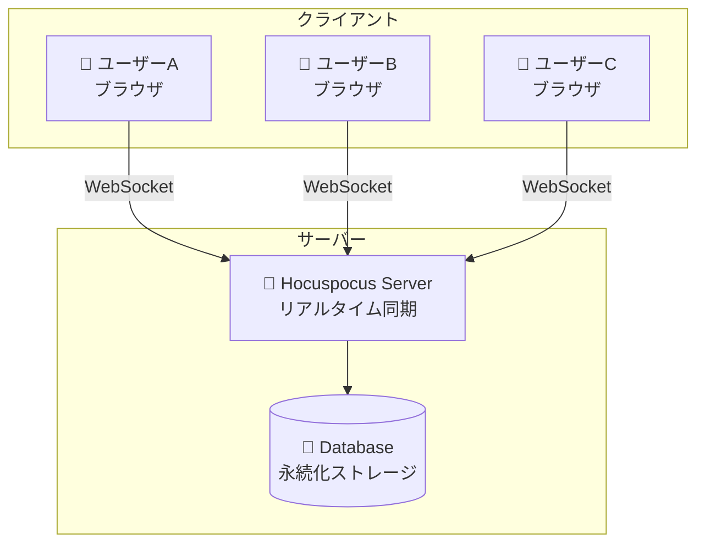
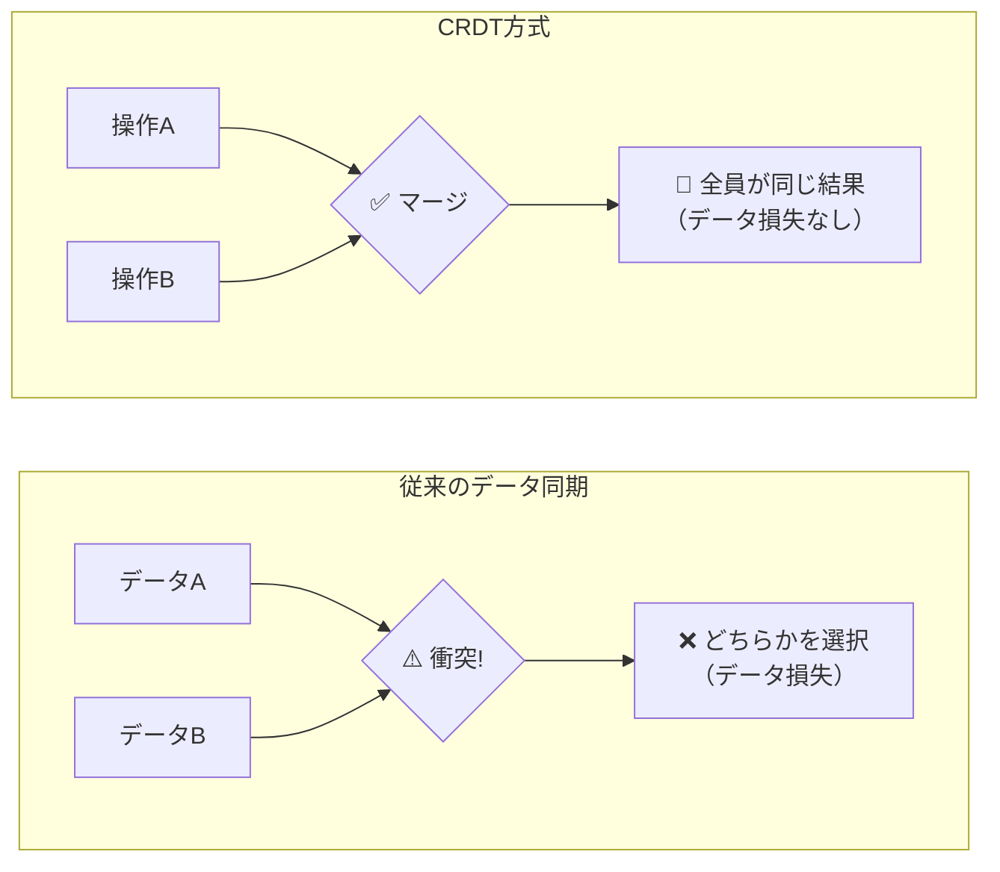
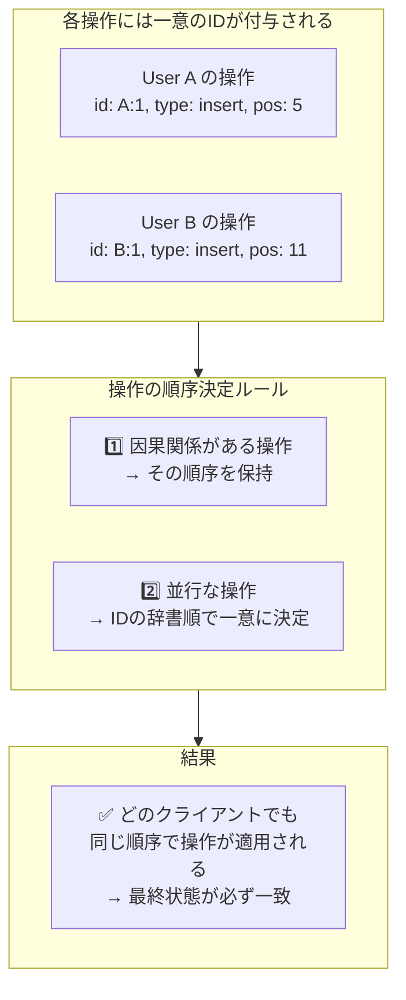
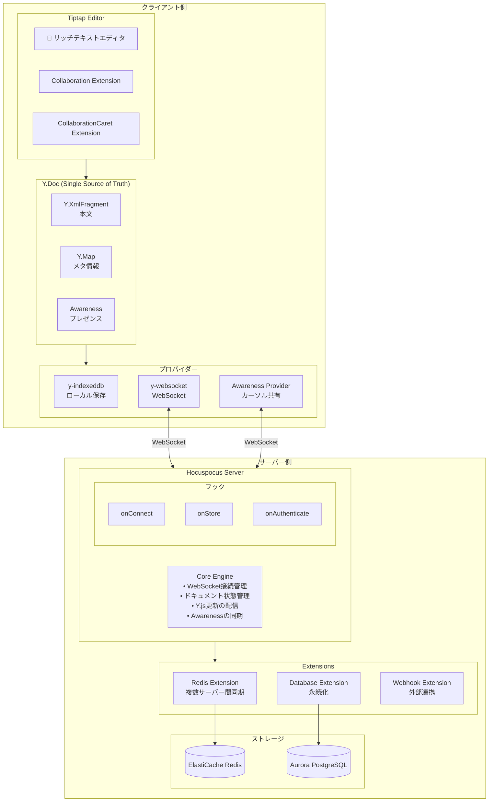
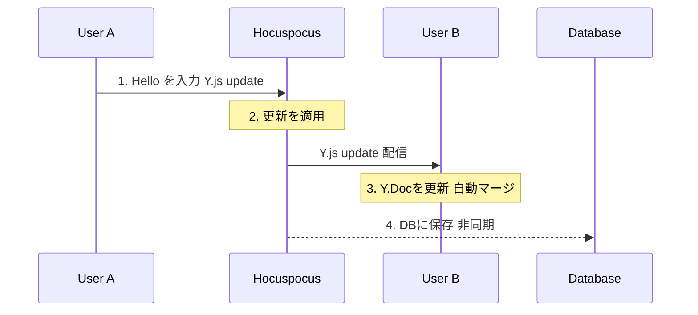
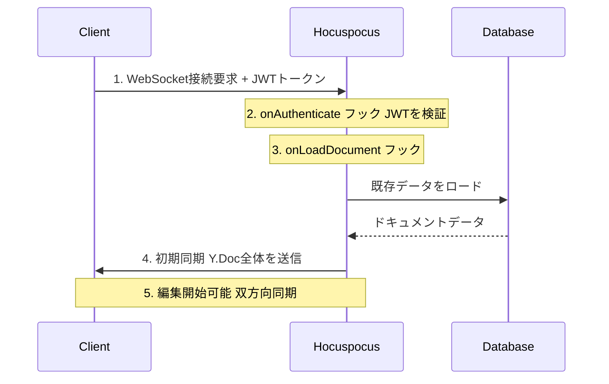
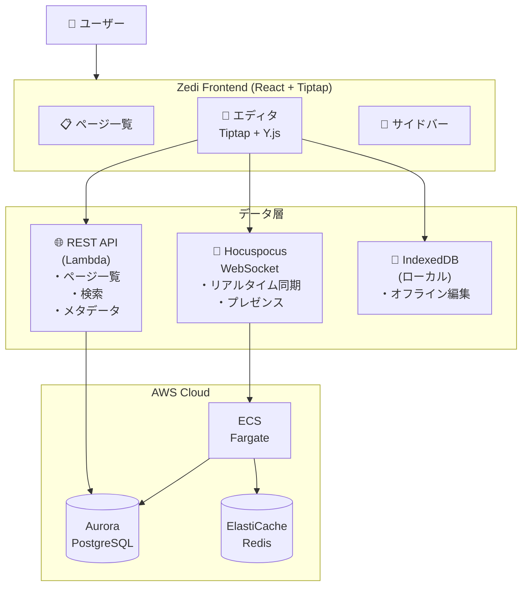
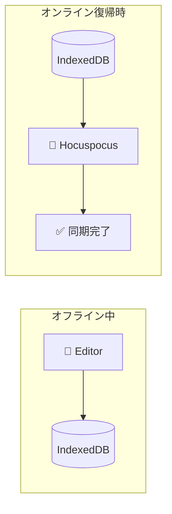
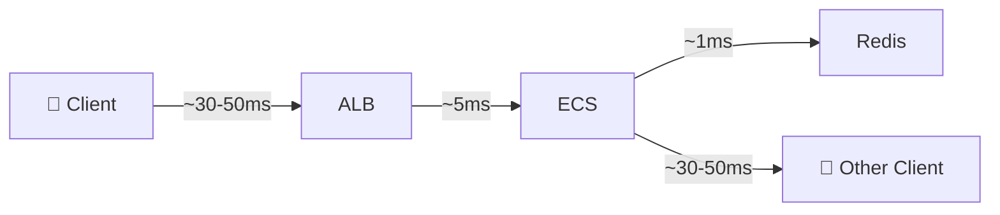

# Hocuspocus リアルタイム同期サーバー 解説ガイド

**Document Version:** 1.0  
**Created:** 2026-02-01  
**Status:** Final  

---

## 目次

1. [Hocuspocusとは何か](#1-hocuspocusとは何か)
2. [なぜHocuspocusが必要なのか](#2-なぜhocuspocusが必要なのか)
3. [基盤技術: Y.js と CRDT](#3-基盤技術-yjs-と-crdt)
4. [アーキテクチャと動作原理](#4-アーキテクチャと動作原理)
5. [Zediプロジェクトでの活用](#5-zediプロジェクトでの活用)
6. [類似技術との比較](#6-類似技術との比較)
7. [よくある質問](#7-よくある質問)

---

## 1. Hocuspocusとは何か

### 1.1 概要

**Hocuspocus**は、リアルタイムコラボレーションを実現するためのWebSocketサーバーです。[Tiptap](https://tiptap.dev/)（リッチテキストエディタ）の開発チームによって作成されました。



### 1.2 主な特徴

| 特徴 | 説明 |
|------|------|
| **リアルタイム同期** | 複数ユーザーの編集を即座に全員に反映 |
| **CRDT ベース** | Y.js を使用した衝突のない自動マージ |
| **プレゼンス機能** | 誰が編集中か、カーソル位置の共有 |
| **永続化対応** | データベースへの自動保存 |
| **認証統合** | JWT等による認証・認可 |
| **スケーラブル** | Redis Pub/Sub による複数サーバー構成 |

### 1.3 どんなアプリで使われているか

- **Notion** のようなノートアプリ
- **Google Docs** のようなドキュメント編集
- **Figma** のようなデザインツール
- **Miro** のようなホワイトボード
- コード共同編集ツール

---

## 2. なぜHocuspocusが必要なのか

### 2.1 従来の方法の問題点

#### ❌ 単純なWebSocket実装の場合

```
問題: 同時編集時の衝突

User A:  "Hello World" → "Hello there World"  (5文字目に挿入)
User B:  "Hello World" → "Hello World!"       (末尾に追加)
                 │
                 ▼
         どちらが正しい？ 
         → "Hello there World!" にしたいが...
         → 単純なマージでは "Hello there World" か "Hello World!" になる
```

#### ✅ Hocuspocus (CRDT) の場合

```
User A:  位置5に "there " を挿入
User B:  位置11に "!" を挿入
              │
              ▼
      CRDTが自動的に両方の変更を正しくマージ
              │
              ▼
      結果: "Hello there World!"  ← 意図通り！
```

### 2.2 Hocuspocusが解決する課題

| 課題 | 従来の方法 | Hocuspocusの解決策 |
|------|-----------|-------------------|
| **編集の衝突** | 後勝ち（データ損失） | CRDTで自動マージ |
| **リアルタイム性** | ポーリング（遅延） | WebSocket（即時） |
| **オフライン対応** | 対応困難 | IndexedDB + 復帰時同期 |
| **スケーラビリティ** | 単一サーバー限界 | Redis Pub/Sub |
| **実装コスト** | 非常に高い | 設定のみで動作 |

---

## 3. 基盤技術: Y.js と CRDT

### 3.1 CRDTとは

**CRDT** (Conflict-free Replicated Data Type) は、「衝突しないレプリケーションデータ型」です。



> **ポイント:** 「最終的な値」ではなく「操作」を同期する

### 3.2 Y.js の仕組み

**Y.js** は、CRDTをJavaScriptで実装したライブラリです。

```typescript
// Y.js の基本的な使い方
import * as Y from 'yjs';

// 1. ドキュメントを作成
const doc = new Y.Doc();

// 2. 共有データ型を取得
const text = doc.getText('content');
const map = doc.getMap('metadata');
const array = doc.getArray('items');

// 3. データを操作
text.insert(0, 'Hello');     // テキストを挿入
map.set('title', 'My Doc');  // キー・バリューを設定
array.push(['item1']);       // 配列に追加

// 4. 変更を監視
text.observe(event => {
  console.log('テキストが変更されました');
});
```

### 3.3 Y.js のデータ型

| データ型 | 説明 | 用途例 |
|----------|------|-------|
| `Y.Text` | テキスト | 文章、コード |
| `Y.Array` | 配列 | リスト、タスク |
| `Y.Map` | オブジェクト | 設定、メタデータ |
| `Y.XmlFragment` | XML/HTML | リッチテキスト |
| `Y.XmlElement` | XML要素 | 構造化コンテンツ |

### 3.4 なぜ「衝突しない」のか



---

## 4. アーキテクチャと動作原理

### 4.1 全体アーキテクチャ



### 4.2 データフロー

#### 4.2.1 編集の同期フロー



#### 4.2.2 接続〜編集開始までのフロー



### 4.3 Hocuspocusのフック（拡張ポイント）

```typescript
import { Hocuspocus } from '@hocuspocus/server';

const server = new Hocuspocus({
  // ───────────────────────────────────────────────
  // 認証フック: 接続時に呼ばれる
  // ───────────────────────────────────────────────
  async onAuthenticate({ token, documentName }) {
    // JWTを検証
    const user = verifyJWT(token);
    
    // ドキュメントへのアクセス権をチェック
    const hasAccess = await checkPermission(user, documentName);
    
    if (!hasAccess) {
      throw new Error('アクセス権がありません');
    }
    
    // 返した値は context として後続のフックで使える
    return { user };
  },

  // ───────────────────────────────────────────────
  // ドキュメント読み込みフック
  // ───────────────────────────────────────────────
  async onLoadDocument({ documentName }) {
    // データベースから既存のドキュメントをロード
    const existingData = await database.getDocument(documentName);
    
    if (existingData) {
      // Y.js形式で返す
      return existingData;
    }
    
    // 新規ドキュメントの場合は null を返す
    return null;
  },

  // ───────────────────────────────────────────────
  // 保存フック: 定期的 or 変更時に呼ばれる
  // ───────────────────────────────────────────────
  async onStoreDocument({ documentName, document }) {
    // Y.Docをバイナリに変換
    const state = Y.encodeStateAsUpdate(document);
    
    // データベースに保存
    await database.saveDocument(documentName, state);
  },

  // ───────────────────────────────────────────────
  // 接続フック
  // ───────────────────────────────────────────────
  async onConnect({ documentName, context }) {
    console.log(`${context.user.name} が接続しました`);
  },

  // ───────────────────────────────────────────────
  // 切断フック
  // ───────────────────────────────────────────────
  async onDisconnect({ documentName, context }) {
    console.log(`${context.user.name} が切断しました`);
  },
});
```

---

## 5. Zediプロジェクトでの活用

### 5.1 Zediにおける役割

Zediは、Notion風のノートアプリで、リアルタイム同時編集機能を実装しています。



### 5.2 現在のインフラ構成（Phase 5 完了時点）

| リソース | サービス | 用途 |
|----------|---------|------|
| **ECS Fargate Spot** | Hocuspocusサーバー | WebSocket処理 |
| **ALB** | ロードバランサー | WebSocket終端 |
| **ECR** | コンテナレジストリ | Dockerイメージ保存 |
| **ElastiCache Redis** | Pub/Sub | 複数サーバー間同期 |
| **Aurora PostgreSQL** | データベース | ドキュメント永続化 |
| **Cognito** | 認証 | JWT発行・検証 |

### 5.3 接続情報

```
WebSocket URL:  ws://zedi-dev-alb-1515915657.ap-northeast-1.elb.amazonaws.com
ECR Repository: 590183877893.dkr.ecr.ap-northeast-1.amazonaws.com/zedi-dev-hocuspocus
ECS Cluster:    zedi-dev-cluster
ECS Service:    zedi-dev-hocuspocus
```

詳細は [hocuspocus-server-implementation.md](../work-logs/20260131/hocuspocus-server-implementation.md) を参照してください。

---

## 6. 類似技術との比較

### 6.1 リアルタイム同期技術の比較

| 技術 | 方式 | 長所 | 短所 |
|------|------|------|------|
| **Hocuspocus + Y.js** | CRDT | 衝突なし、オフライン対応 | 学習コスト |
| **Firebase Realtime DB** | Last-write-wins | 簡単に使える | 衝突で上書き |
| **Socket.io** | 手動同期 | 柔軟性が高い | 自前実装が大変 |
| **Operational Transform** | OT | Google Docsで実績 | サーバー中央集権 |
| **ShareDB** | OT | JSONに最適化 | CRDTより複雑 |

### 6.2 Y.js vs Operational Transform (OT)

| 観点 | Y.js (CRDT) | Operational Transform (OT) |
|------|-------------|---------------------------|
| **アーキテクチャ** | 分散型（P2Pも可能） | 中央集権型（サーバーが正） |
| **オフライン対応** | ✅ ローカルで完結 | ⚠️ サーバーとの整合性が難しい |
| **実装難易度** | シンプル（ライブラリ任せ） | 複雑（操作ごとに変換が必要） |
| **メモリ効率** | やや多め（履歴も保持） | 効率的（現在状態のみ） |
| **収束保証** | ✅ 数学的に証明 | 実装次第（パズルが複雑） |

> **結論:** 新規開発なら **Y.js (CRDT) がおすすめ**

### 6.3 Hocuspocus vs 他のY.jsサーバー

| サーバー | 特徴 | おすすめ用途 |
|----------|------|------------|
| **Hocuspocus** | 高機能、Tiptap統合 | プロダクション |
| **y-websocket** | 最小限の実装 | プロトタイプ |
| **Liveblocks** | SaaS型 | 時間節約したい場合 |
| **Partykit** | エッジ実行 | 低レイテンシ重視 |

---

## 7. よくある質問

### Q1: オフライン時に編集したらどうなりますか？

IndexedDBにローカル保存されます。オンライン復帰時に自動的にサーバーと同期され、CRDTにより衝突なくマージされます。



### Q2: 100人が同時に編集したらどうなりますか？

Hocuspocusは設計上、多数の同時接続に対応しています。

1. Redis Pub/Sub により複数サーバーにスケールアウト
2. 差分のみを送信するため帯域効率が良い
3. Awareness (プレゼンス) は軽量なデータ

> **実績:** Notion等で数十人の同時編集は一般的

### Q3: データの整合性は保証されますか？

はい。CRDTの数学的性質により保証されます。

- ✅ どの順序で操作が適用されても最終状態は同一
- ✅ ネットワーク遅延があっても問題なし
- ✅ 操作が失われない限りデータは損失しない

### Q4: セキュリティはどうなっていますか？

複数レイヤーで保護しています。

| レイヤー | 技術 |
|----------|------|
| 認証 | Cognito JWT |
| 認可 | onAuthenticate フック |
| 通信暗号化 | WSS (WebSocket Secure) |
| ネットワーク | VPC内プライベートサブネット |

### Q5: どのくらいのレイテンシがありますか？

一般的に **100-200ms** 程度です。



---

## 参考リンク

- [Hocuspocus 公式ドキュメント](https://hocuspocus.dev/)
- [Y.js 公式ドキュメント](https://docs.yjs.dev/)
- [Tiptap 公式サイト](https://tiptap.dev/)
- [CRDT Wikipedia](https://en.wikipedia.org/wiki/Conflict-free_replicated_data_type)
- [Zedi リアルタイム同時編集仕様](../specs/realtime-collaboration-specification.md)
- [Hocuspocusサーバー実装ガイド](../work-logs/20260131/hocuspocus-server-implementation.md)

---

*このドキュメントは2026-02-01に作成されました。*
