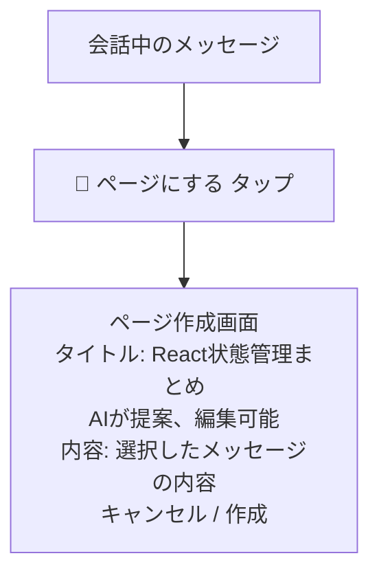
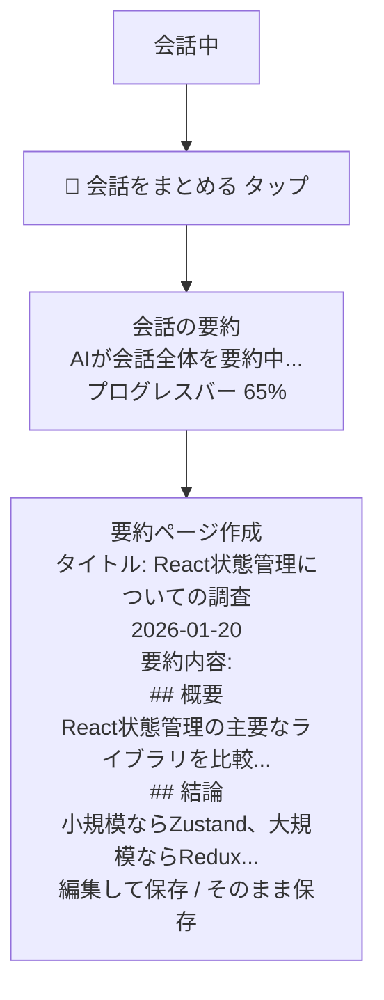
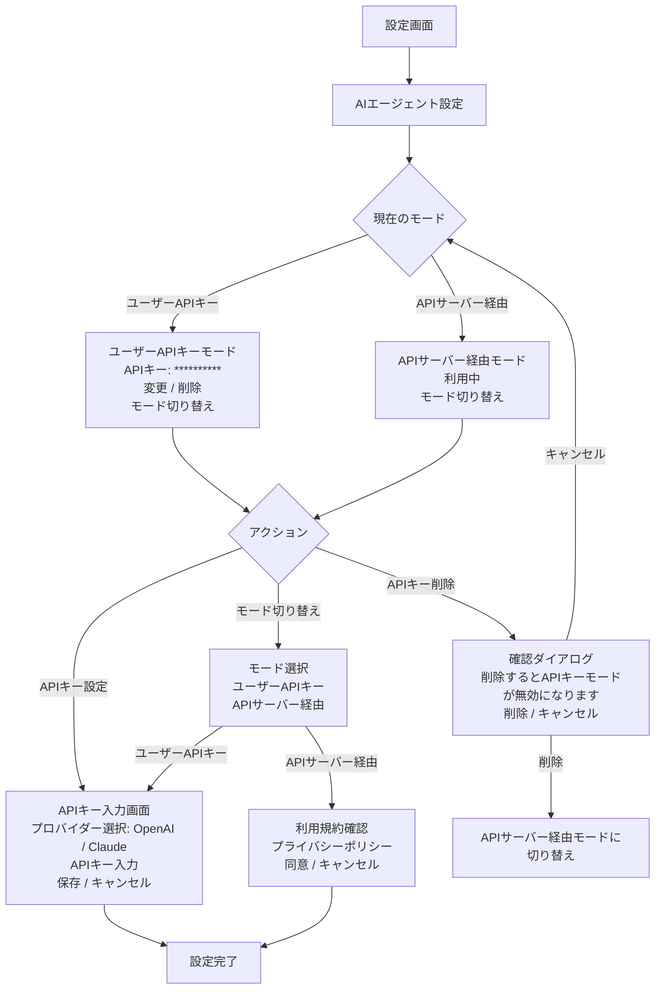
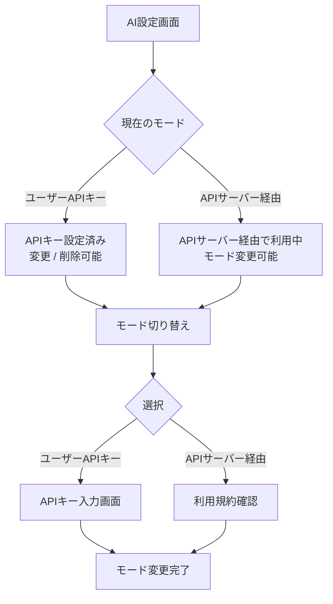
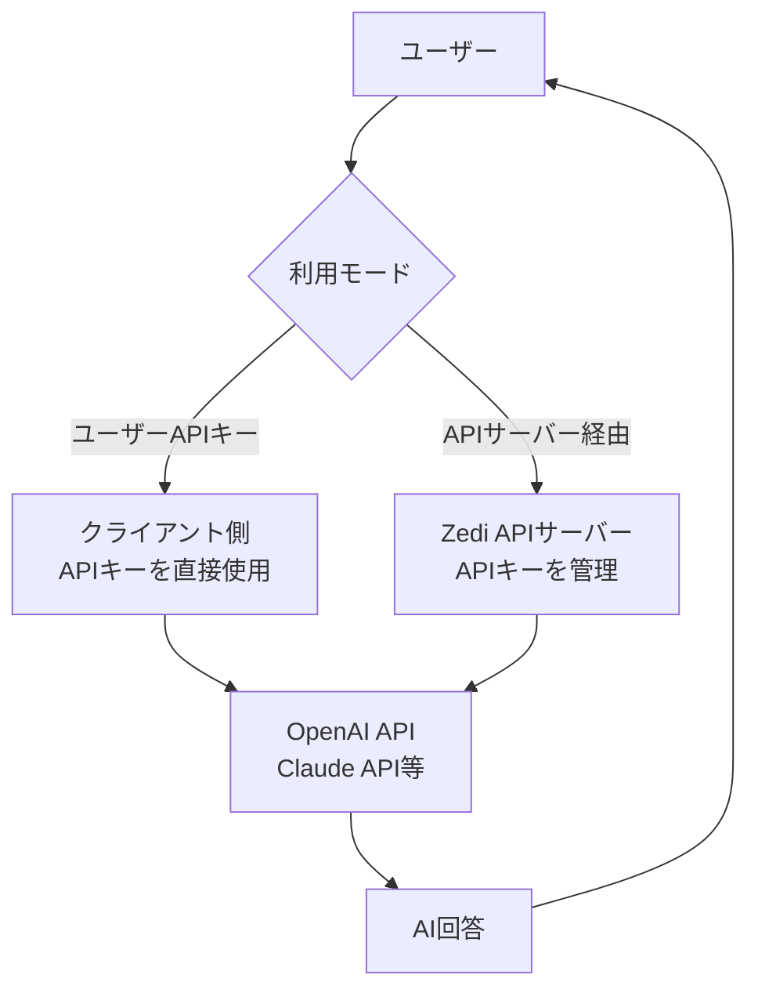

# AIエージェント機能

## 1. この機能について

### 1.1 背景と目的

Zediはメモ・ノートアプリですが、単に情報を記録するだけでなく、**知識を深め、整理し、活用する**ツールを目指しています。

AIエージェント機能は、ユーザーがAIと対話しながら：
- 自分の過去のメモを参照して答えを得る
- Web検索で最新情報を取得する
- 会話の中で生まれた気づきを新しいページとして保存する

これらを実現し、「考えるパートナー」としてのAI体験を提供します。

### 1.2 用語説明

| 用語 | 説明 |
|------|------|
| AIエージェント | ユーザーと対話し、質問に答えたり、情報を整理したりするAIアシスタント |
| RAG (Retrieval-Augmented Generation) | ユーザーのメモを検索し、その情報を踏まえてAIが回答を生成する手法 |
| Embedding | テキストを数値ベクトルに変換する技術。意味的な類似性で検索できる |
| LLM (Large Language Model) | ChatGPT、Claude などの大規模言語モデル |
| Wikiリンク | `[[ページ名]]` 形式で他のページを参照するリンク |
| ユーザーAPIキーモード | ユーザーが自分でAPIキーを設定し、クライアントから直接APIを呼び出す方式 |
| APIサーバー経由モード | ZediのAPIサーバーがAPIキーを管理し、ユーザーは設定不要で利用できる方式 |

### 1.3 ゴール

- AIに質問すると、自分のメモ + Web検索を踏まえた回答が得られる
- 会話で得た知見をワンタップでページ化できる
- 過去のメモとの関連性を発見し、知識を繋げられる

---

## 2. ユーザーストーリー

### ストーリー1: 過去のメモを踏まえた調べ物

> **エンジニアの田中さんの場合**
>
> 1. 「Reactの状態管理について調べたい」と思い、AIエージェントを開く
> 2. 「Reactの状態管理ライブラリ、それぞれの特徴を教えて」と入力
> 3. AIが回答:
>    - Web検索で最新のライブラリ情報を取得
>    - 田中さんの過去のメモから「Redux使ってみた」「Zustand導入メモ」を発見して参照
>    - 「あなたの過去のメモによると、Zustandを使った経験があるようですね。Redux と比較すると...」
> 4. 回答の中で気になった「Jotai」について「詳しく教えて」とフォローアップ
> 5. 最終的に「この会話をまとめてページにしたい」→ 要約ページが自動生成
> 6. 作成されたページを編集し、既存の「Zustand導入メモ」とWikiリンクで繋げる

### ストーリー2: 考えを整理する対話

> **プロダクトマネージャーの鈴木さんの場合**
>
> 1. 新機能のアイデアはあるが、整理できていない
> 2. AIエージェントで「この機能のアイデアについて整理を手伝って」と依頼
> 3. AIが質問を投げかける:「この機能で解決したい課題は何ですか？」
> 4. 対話を繰り返しながら、アイデアが構造化されていく
> 5. 「いい感じにまとまってきた。このやり取りをページにして」
> 6. 会話が「新機能アイデア: ○○」としてページ化される

### ストーリー3: 学習内容の振り返り

> **学習中の山田さんの場合**
>
> 1. 最近学んだことを復習したい
> 2. AIエージェントで「最近の学習内容をまとめて」と依頼
> 3. AIが過去2週間の学習関連メモを検索
> 4. 「あなたは最近、以下のトピックについて学んでいます:」と一覧表示
>    - TypeScriptの型システム
>    - Reactのパフォーマンス最適化
>    - テスト駆動開発
> 5. 「TypeScriptの型システムについて詳しく見せて」
> 6. 関連するメモの内容を要約して表示
> 7. 気になる部分をハイライト → 「この部分を新しいページにして」

---

## 3. 画面フロー

### 3.1 全体の画面構成

```
┌────────────────────────────────────────────────────────────┐
│  ← 戻る        AIエージェント                    [履歴] [設定] │
├────────────────────────────────────────────────────────────┤
│                                                            │
│  ┌─────────────────────────────────────────┐              │
│  │ 🤖 こんにちは！何かお手伝いできることは  │              │
│  │    ありますか？                        │              │
│  └─────────────────────────────────────────┘              │
│                                                            │
│              ┌─────────────────────────────────────────┐  │
│              │ Reactの状態管理について教えて       👤   │  │
│              └─────────────────────────────────────────┘  │
│                                                            │
│  ┌─────────────────────────────────────────┐              │
│  │ 🤖 Reactの状態管理には複数の選択肢が    │              │
│  │    あります。                          │              │
│  │                                        │              │
│  │    📎 参照したメモ:                    │ ← 参照元を表示 │
│  │    - [[Redux使ってみた]]               │              │
│  │    - [[Zustand導入メモ]]               │              │
│  │                                        │              │
│  │    あなたの過去のメモによると...       │              │
│  │                                        │              │
│  │    [📄 ページにする] [📋 コピー]        │ ← アクション  │
│  └─────────────────────────────────────────┘              │
│                                                            │
├────────────────────────────────────────────────────────────┤
│  ┌──────────────────────────────────────────────────────┐ │
│  │ メッセージを入力...                      [🎤] [送信] │ │
│  └──────────────────────────────────────────────────────┘ │
│                                                            │
│  [🔍 メモを検索] [🌐 Web検索] [📝 会話をまとめる]         │ ← クイックアクション
└────────────────────────────────────────────────────────────┘
```

### 3.2 サイドパネル（デスクトップ）

デスクトップ表示では、参照したメモや検索結果をサイドパネルに表示できます。

```
┌───────────────────────────────────┬────────────────────────┐
│                                   │   📎 参照元            │
│        チャットエリア             │                        │
│                                   │   メモ                 │
│                                   │   ┌─────────────────┐  │
│                                   │   │ Redux使ってみた │  │
│                                   │   │ 2025-12-15      │  │
│                                   │   │ Reduxを使って...│  │
│                                   │   └─────────────────┘  │
│                                   │                        │
│                                   │   Web検索結果          │
│                                   │   ┌─────────────────┐  │
│                                   │   │ 🌐 React状態管理 │  │
│                                   │   │    比較記事      │  │
│                                   │   └─────────────────┘  │
└───────────────────────────────────┴────────────────────────┘
```

> **注**: レイアウト図のためテキスト形式で表現しています。

### 3.3 ページ化のフロー

#### パターン1: 個別メッセージをページ化



#### パターン2: 会話全体を要約してページ化



### 3.4 AI設定画面

#### 設定画面のフロー



#### 設定画面のUI例

```
┌─────────────────────────────────────────┐
│  ← 戻る        AIエージェント設定         │
├─────────────────────────────────────────┤
│                                         │
│  利用モード                              │
│  ┌───────────────────────────────────┐  │
│  │ ◉ ユーザーAPIキー                 │  │
│  │                                   │  │
│  │   APIキー: **********             │  │
│  │   [変更] [削除]                    │  │
│  └───────────────────────────────────┘  │
│                                         │
│  ┌───────────────────────────────────┐  │
│  │ ○ APIサーバー経由                 │  │
│  │                                   │  │
│  │   設定不要で利用できます           │  │
│  │   [利用規約を確認]                 │  │
│  └───────────────────────────────────┘  │
│                                         │
│  その他の設定                            │
│  ┌───────────────────────────────────┐  │
│  │ 参照範囲: [全メモ ▼]              │  │
│  │ Web検索: [有効 ▼]                 │  │
│  │ 会話履歴の保存: [有効 ▼]          │  │
│  └───────────────────────────────────┘  │
│                                         │
│  [保存]                                  │
└─────────────────────────────────────────┘
```

---

## 4. 機能仕様

### 4.1 AIとの対話

| 機能 | 説明 | 動作 |
|------|------|------|
| 自然言語での質問 | 何でも自由に質問できる | テキスト入力 → AI回答 |
| 文脈の保持 | 会話の流れを維持 | 前のメッセージを踏まえた回答 |
| フォローアップ | 回答に対してさらに質問 | 「もっと詳しく」「例を教えて」など |
| 会話のリセット | 新しいトピックで会話開始 | 「新しい会話」ボタン |

### 4.2 メモの参照（RAG）

| 機能 | 説明 | 動作 |
|------|------|------|
| 自動検索 | 質問に関連するメモを自動検索 | キーワード or ベクトル検索 |
| 手動指定 | 参照するメモを指定 | 「[[ページ名]]を参照して」と入力 |
| 参照元表示 | どのメモを参照したか表示 | 回答にリンク付きで表示 |
| 参照範囲設定 | 検索対象の絞り込み | 全メモ / 特定タグ / 最近のメモ |

### 4.3 Web検索

| 機能 | 説明 | 動作 |
|------|------|------|
| 自動検索 | 最新情報が必要な場合に自動実行 | 「2024年の最新...」など |
| 手動指定 | 明示的にWeb検索を要求 | 「Webで調べて」「最新情報を教えて」 |
| 検索結果表示 | 参照したWebページを表示 | URLとタイトルをリンク表示 |
| 検索オフ | Web検索を無効化 | 設定またはメモのみモード |

### 4.4 ページへの変換

| 機能 | 動作 | ユースケース |
|------|------|-------------|
| メッセージをページ化 | 選択したメッセージを新規ページに | 気になる回答を保存 |
| 会話を要約してページ化 | 会話全体をAIが要約して保存 | 対話で得た知見をまとめる |
| 既存ページに追記 | 会話内容を既存ページに追加 | メモの補足情報として追加 |
| テキスト選択→ページ化 | 部分選択して新規ページ作成 | 特定の部分だけを抽出 |

### 4.5 知識の連携

| 機能 | 説明 | 動作 |
|------|------|------|
| 関連メモ提案 | 会話内容に関連するメモを提案 | 「関連するメモ: [[○○]]」 |
| Wikiリンク自動検出 | 既存ページ名が含まれたら自動リンク | キーワードを `[[]]` でラップ |
| 新規ページ候補 | 新しい概念をページ化候補として提案 | 「新しいトピック『○○』をページ化しますか？」 |

### 4.6 API利用モード

AIエージェント機能は、2つの利用モードをサポートします：

| モード | 説明 | 対象ユーザー |
|-------|------|-------------|
| **ユーザーAPIキー** | ユーザーが自分でAPIキーを設定して使用 | コストを自分で管理したい、プライバシー重視のユーザー |
| **APIサーバー経由** | ZediのAPIサーバー経由で利用（APIキー不要） | すぐに使い始めたい、設定を簡素化したいユーザー |

#### ユーザーAPIキーモード

**特徴:**
- ユーザーがOpenAI等のAPIキーを直接設定
- APIキーはユーザーのデバイスにのみ保存（暗号化）
- 利用料金はユーザーが直接API提供者に支払い
- プライバシー重視：メモデータがZediサーバーを経由しない

**設定方法:**
1. AI設定画面を開く
2. 「APIキーを設定」を選択
3. OpenAI APIキーを入力（またはClaude等）
4. 保存（ローカルストレージに暗号化して保存）

**利用制限:**
- ユーザーが設定したAPIキーの制限に従う
- レート制限や使用量はAPI提供者のダッシュボードで確認

#### APIサーバー経由モード

**特徴:**
- APIキーの設定不要で即座に利用可能
- ZediのAPIサーバーがAPIキーを管理
- 利用制限や課金はZedi側で管理（将来的に有料プラン対応の可能性）
- 初回利用が簡単

**利用開始:**
1. AIエージェント画面を開く
2. 初回のみ利用規約に同意
3. すぐに利用開始

**利用制限（想定）:**
- 無料プラン: 1日あたりN回のリクエスト
- 有料プラン: 制限緩和または無制限（将来実装）

**プライバシー:**
- メモデータはZediサーバーを経由する
- データ保持ポリシーを明示
- ユーザーが削除を要求した場合、サーバー側のデータも削除

#### モードの切り替え



---

## 5. ユースケースと活用例

### 5.1 主なユースケース

| ユースケース | シナリオ | AIの動作 |
|-------------|---------|---------|
| **調べ物・リサーチ** | 「Reactの状態管理ライブラリを比較して」 | Web検索 + 過去メモ参照 → 比較表を作成 |
| **学習・理解深化** | 「自分のメモで機械学習についてまとめて」 | メモを検索・要約 → 学習状況を整理 |
| **アイデア整理** | 「このアイデアの課題を一緒に考えて」 | 対話で深掘り → 整理された形でページ化 |
| **振り返り** | 「今日の作業内容をまとめて」 | 今日のメモを検索 → 日報形式で要約 |
| **ブレインストーミング** | 自由に対話 | 出てきたアイデアを個別ページ化 |
| **タスク整理** | 「今週やるべきことを整理して」 | TODOメモを検索 → 優先順位付け |

### 5.2 具体的な対話例

#### 例1: 技術調査

```
👤 ユーザー: Next.js 15のServer Actionsについて教えて

🤖 AI: Next.js 15のServer Actionsについて説明します。

   📎 参照したメモ:
   - [[Next.js 14メモ]]

   🌐 Web検索結果:
   - Next.js 15 Release Notes (公式)
   - Server Actions Deep Dive (dev.to)

   Server Actionsは、サーバーサイドで実行される関数を
   コンポーネントから直接呼び出せる機能です。
   
   あなたの過去のメモによると、Next.js 14でもServer Actionsを
   試されていたようですね。15での主な変更点は...

   [📄 ページにする] [📋 コピー]

👤 ユーザー: 14からの変更点だけまとめて

🤖 AI: Next.js 14 → 15 のServer Actions変更点:

   1. パフォーマンス改善
      - キャッシュ戦略の最適化
      - バンドルサイズ削減
   
   2. 新機能
      - useFormStatus の改善
      - エラーハンドリングの強化
   
   3. 破壊的変更
      - revalidateTag の動作変更

   [📄 ページにする] [📋 コピー]
```

#### 例2: 思考整理

```
👤 ユーザー: 新しいプロダクトのアイデアがあるんだけど、整理を手伝って

🤖 AI: もちろんです！整理のお手伝いをしますね。
   
   まず、そのプロダクトのアイデアを簡単に教えてもらえますか？
   一言で言うと、何を解決するものですか？

👤 ユーザー: タスク管理と習慣トラッキングを組み合わせたアプリ

🤖 AI: なるほど、タスク管理と習慣トラッキングの融合ですね。
   
   📎 参照したメモ:
   - [[習慣化のコツ]]
   - [[タスク管理ツール比較]]
   
   いくつか質問させてください:
   
   1. 既存のTodoistやHabiticaとの違いは何ですか？
   2. メインターゲットは誰を想定していますか？
   3. 最も大切にしたいコア機能は何ですか？

👤 ユーザー: 違いは、タスクの完了が自動で習慣のトラッキングに
   反映されること。ターゲットは忙しいビジネスパーソン。
   コア機能は「やったことが自動で記録される」こと。

🤖 AI: 整理できてきました！

   ## プロダクトコンセプト
   
   **一言で**: タスク完了が自動で習慣トラッキングに反映される
   
   **差別化ポイント**:
   - 手動入力不要（タスク完了 = 習慣記録）
   - タスク管理と習慣化が一体化
   
   **ターゲット**: 忙しいビジネスパーソン
   - 複数ツールを使い分ける時間がない
   - 習慣化したいが記録が続かない
   
   **コア機能**: 自動記録
   - タスク完了時に関連する習慣カテゴリに自動反映
   
   この方向で合っていますか？他に追加したい要素はありますか？
   
   [📝 この会話をページにまとめる]
```

---

## 6. エラーハンドリング

| 状況 | ユーザーへの表示 | 対処 |
|------|-----------------|------|
| AIサービス接続エラー | 「AIサービスに接続できません。しばらくしてからお試しください」 | オフラインモード案内、再試行ボタン |
| メモ検索失敗 | 「メモの検索ができませんでした。Web検索のみで回答します」 | Web検索のみで回答を生成 |
| Web検索失敗 | 「Web検索ができませんでした。メモのみを参照して回答します」 | メモのみで回答を生成 |
| 要約生成失敗 | 「要約の生成に失敗しました」 | 元の会話をそのまま保存する選択肢を提示 |
| ページ作成失敗 | 「ページの作成に失敗しました」 | クリップボードにコピー、手動作成を案内 |
| レート制限 | 「リクエスト上限に達しました。しばらくお待ちください」 | 待機時間を表示 |
| APIキー無効 | 「APIキーが無効です。設定を確認してください」 | 設定画面へのリンクを表示 |
| APIサーバー認証エラー | 「認証に失敗しました。再度ログインしてください」 | ログイン画面へのリンク |
| APIサーバー利用制限到達 | 「本日の利用上限に達しました。明日またお試しください」 | 利用量表示、有料プランへの誘導（将来） |

---

## 7. 技術設計

### 7.1 AI基盤の選択肢

| 項目 | 選択肢 | 推奨（Phase 1） |
|------|--------|----------------|
| LLMプロバイダー | OpenAI GPT-4 / Claude / ローカルLLM | OpenAI GPT-4（コスト・精度バランス） |
| メモ検索 | キーワード検索 / ベクトル検索（Embedding） | キーワード検索（シンプル） |
| Web検索 | Google API / Bing API / Perplexity API | Perplexity API（対話向け） |

### 7.2 メモ参照の方式

| 方式 | 説明 | メリット | デメリット |
|------|------|----------|------------|
| **キーワード検索** | 質問から抽出したキーワードでメモを検索 | 実装が簡単、高速 | 表記揺れに弱い |
| **ベクトル検索（RAG）** | Embeddingで意味的に類似したメモを検索 | 意味で検索可能 | Embedding生成コスト |
| **全文参照** | 小規模なら全メモをコンテキストに含める | 取りこぼしがない | メモが多いと不可能 |
| **選択的参照** | ユーザーが参照するメモを指定 | 意図通りの参照 | 手動操作が必要 |

### 7.3 プライバシー・セキュリティ

| 考慮事項 | 対応 |
|---------|------|
| メモの外部送信 | 初回利用時に同意ダイアログを表示 |
| ローカル処理オプション | Phase 3でローカルLLM対応を検討 |
| 参照範囲の設定 | 「全メモ」「選択したタグのみ」「今日のメモのみ」など |
| データ保持 | AI提供者側でのデータ保持ポリシーを明示 |
| APIキーの保存 | ユーザーAPIキーはローカルストレージに暗号化して保存 |
| APIサーバー経由時のデータ保護 | 暗号化通信（HTTPS）、最小限のデータ送信 |

### 7.4 API利用モードの実装

#### アーキテクチャ



#### ユーザーAPIキーモードの実装

**クライアント側:**
- APIキーをローカルストレージに保存（暗号化推奨）
- クライアントから直接API提供者にリクエスト
- CORS設定が必要な場合はプロキシサーバー経由

**セキュリティ:**
- APIキーは暗号化して保存（例: Web Crypto API）
- ブラウザの開発者ツールで見えないようにする（完全な保護は困難だが、最低限の対策）

#### APIサーバー経由モードの実装

**サーバー側（Zedi API）:**
- APIキーを環境変数またはシークレット管理で保存
- ユーザー認証（JWT等）でリクエストを検証
- レート制限の実装（ユーザー単位、IP単位）
- ログ記録（プライバシーに配慮）

**クライアント側:**
- ユーザー認証トークンを含めてリクエスト
- エラーハンドリング（レート制限、認証エラー等）

**エンドポイント例:**
```
POST /api/ai/chat
Headers:
  Authorization: Bearer <user_token>
Body:
  {
    "messages": [...],
    "mode": "rag", // or "web_search"
    "context": {
      "memo_ids": [...],
      "search_query": "..."
    }
  }
```

#### モード判定ロジック

```typescript
// 疑似コード
function getAIMode(): 'user_api_key' | 'api_server' {
  const userApiKey = getStoredApiKey();
  if (userApiKey) {
    return 'user_api_key';
  }
  return 'api_server';
}

async function sendMessage(message: string) {
  const mode = getAIMode();
  
  if (mode === 'user_api_key') {
    // クライアントから直接API呼び出し
    return await callOpenAIDirectly(message, userApiKey);
  } else {
    // Zedi APIサーバー経由
    return await callZediAPIServer(message, userToken);
  }
}
```

#### コスト管理

| モード | コスト負担 | 管理方法 |
|-------|-----------|---------|
| **ユーザーAPIキー** | ユーザー | API提供者のダッシュボードで確認・設定 |
| **APIサーバー経由** | Zedi | サーバー側で使用量を追跡、将来的に課金プラン対応 |

---

## 8. 実装計画

### 8.1 Phase 1: MVP

**スコープ:**
- シンプルなチャットUI
- OpenAI GPT-4 連携
- **ユーザーAPIキーモード**の実装（既存実装を活用）
- メモのキーワード検索による参照
- 会話の一部をコピー → 新規ページ作成（手動）

**技術要件:**
- OpenAI API連携（クライアント側）
- APIキーのローカル保存（暗号化）
- 既存の検索機能を活用
- チャットUIコンポーネント

**非スコープ:**
- APIサーバー経由モード（Phase 2で実装）

### 8.2 Phase 2: 拡張

**追加機能:**
- **APIサーバー経由モード**の実装
  - Zedi APIサーバーの構築
  - ユーザー認証連携
  - レート制限の実装
  - 利用規約・プライバシーポリシーの整備
- 「ページにする」アクションの追加
- 会話要約 → ページ化
- ベクトル検索による関連メモ検索（Embedding）
- Web検索連携（Perplexity API）
- 参照元メモの表示
- モード切り替えUIの実装

### 8.3 Phase 3: 発展

**追加機能:**
- APIサーバー経由モードの課金プラン対応（有料プラン）
- 使用量ダッシュボード（両モード共通）
- リアルタイムでのメモ提案
- Wikiリンク自動検出・生成
- 会話履歴の保存・検索
- ローカルLLM対応（プライバシー重視ユーザー向け）
- 音声入力での対話

---

## 9. 関連ドキュメント

| ドキュメント | 内容 |
|-------------|------|
| [FAB選択フロー設計](./fab-selection-flow.md) | FABメニュー全体の設計 |
| [テンプレートからページ作成](./template-creation.md) | テンプレート機能の詳細設計 |
| [音声からページ作成](./voice-creation.md) | 音声入力機能の詳細設計 |
| [AI基盤実装のリファクタリング計画](./ai-implementation-refactoring.md) | 既存LLM機能を2つのモードに対応させる実装計画 |
