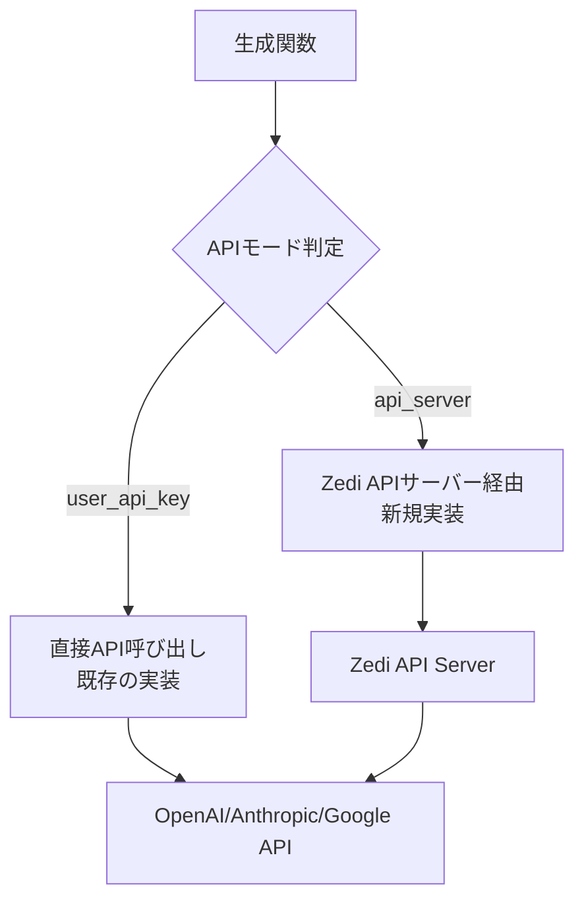

# AI基盤実装のリファクタリング計画

## 1. 現状分析

### 1.1 現在のLLM使用箇所

| 機能 | ファイル | 使用箇所 |
|------|---------|---------|
| **Wiki生成** | `src/lib/wikiGenerator.ts` | `generateWithOpenAI()`, `generateWithAnthropic()`, `generateWithGoogle()` |
| **Mermaid生成** | `src/lib/mermaidGenerator.ts` | `generateWithOpenAI()`, `generateWithAnthropic()`, `generateWithGoogle()` |
| **AIクライアント生成** | `src/lib/aiClient.ts` | `createAIClient()` |
| **接続テスト** | `src/lib/aiClient.ts` | `testConnection()`, `testOpenAIConnection()`, etc. |

### 1.2 現在の実装パターン

```typescript
// 現在の実装例（wikiGenerator.ts）
async function generateWithOpenAI(
  settings: AISettings,
  title: string,
  callbacks: WikiGeneratorCallbacks,
  abortSignal?: AbortSignal
): Promise<void> {
  const client = new OpenAI({
    apiKey: settings.apiKey,  // ← 直接APIキーを使用
    dangerouslyAllowBrowser: true,
  });
  // ...
}
```

**問題点:**
- APIキーを直接使用しているため、APIサーバー経由モードに対応できない
- 各生成関数が個別にクライアントを作成しており、モード判定ロジックがない

---

## 2. 修正方針

### 2.1 アーキテクチャの変更



### 2.2 型定義の拡張

#### `src/types/ai.ts` の修正

```typescript
export type APIMode = "user_api_key" | "api_server";

export interface AISettings {
  provider: AIProviderType;
  apiKey: string;  // ユーザーAPIキーモード時のみ使用
  apiMode: APIMode;  // ← 新規追加
  model: string;
  isConfigured: boolean;
  ollamaEndpoint?: string;
}

export const DEFAULT_AI_SETTINGS: AISettings = {
  provider: "ollama",
  apiKey: "",
  apiMode: "api_server",  // ← デフォルトはAPIサーバー経由
  model: "qwen2.5:7b",
  isConfigured: false,
  ollamaEndpoint: "http://localhost:11434",
};
```

### 2.3 新しい抽象化レイヤーの追加

#### `src/lib/aiService.ts` の新規作成

```typescript
// AIサービス抽象化レイヤー
// モードに応じて適切な方法でAPIを呼び出す

export interface AIServiceRequest {
  provider: AIProviderType;
  model: string;
  messages: Array<{ role: string; content: string }>;
  options?: {
    temperature?: number;
    maxTokens?: number;
    stream?: boolean;
  };
}

export interface AIServiceResponse {
  content: string;
  finishReason?: string;
}

/**
 * ストリーミング対応のAIサービス呼び出し
 */
export async function callAIService(
  settings: AISettings,
  request: AIServiceRequest,
  callbacks: {
    onChunk?: (chunk: string) => void;
    onComplete?: (response: AIServiceResponse) => void;
    onError?: (error: Error) => void;
  },
  abortSignal?: AbortSignal
): Promise<void> {
  if (settings.apiMode === "user_api_key") {
    // 既存の実装を使用（直接API呼び出し）
    return await callAIWithUserKey(settings, request, callbacks, abortSignal);
  } else {
    // APIサーバー経由
    return await callAIWithServer(settings, request, callbacks, abortSignal);
  }
}

/**
 * ユーザーAPIキーで直接呼び出し
 */
async function callAIWithUserKey(
  settings: AISettings,
  request: AIServiceRequest,
  callbacks: {
    onChunk?: (chunk: string) => void;
    onComplete?: (response: AIServiceResponse) => void;
    onError?: (error: Error) => void;
  },
  abortSignal?: AbortSignal
): Promise<void> {
  // 既存のcreateAIClient()を使用
  const client = createAIClient(settings);
  
  // プロバイダーごとの処理（既存ロジックを再利用）
  switch (settings.provider) {
    case "openai":
      // 既存のgenerateWithOpenAI()のロジックを再利用
      break;
    case "anthropic":
      // 既存のgenerateWithAnthropic()のロジックを再利用
      break;
    // ...
  }
}

/**
 * APIサーバー経由で呼び出し
 */
async function callAIWithServer(
  settings: AISettings,
  request: AIServiceRequest,
  callbacks: {
    onChunk?: (chunk: string) => void;
    onComplete?: (response: AIServiceResponse) => void;
    onError?: (error: Error) => void;
  },
  abortSignal?: AbortSignal
): Promise<void> {
  // ユーザー認証トークンを取得（既存の認証システムを使用）
  const userToken = await getUserAuthToken();
  if (!userToken) {
    throw new Error("認証が必要です");
  }

  const response = await fetch("/api/ai/chat", {
    method: "POST",
    headers: {
      "Content-Type": "application/json",
      "Authorization": `Bearer ${userToken}`,
    },
    body: JSON.stringify({
      provider: settings.provider,
      model: settings.model,
      messages: request.messages,
      options: request.options,
    }),
    signal: abortSignal,
  });

  if (!response.ok) {
    const error = await response.json();
    callbacks.onError?.(new Error(error.message || "API呼び出しに失敗しました"));
    return;
  }

  // ストリーミング処理
  const reader = response.body?.getReader();
  if (!reader) {
    throw new Error("レスポンスボディが取得できません");
  }

  const decoder = new TextDecoder();
  let fullContent = "";

  while (true) {
    const { done, value } = await reader.read();
    if (done) break;

    const chunk = decoder.decode(value);
    const lines = chunk.split("\n").filter(Boolean);

    for (const line of lines) {
      if (line.startsWith("data: ")) {
        const data = JSON.parse(line.slice(6));
        if (data.content) {
          fullContent += data.content;
          callbacks.onChunk?.(data.content);
        }
        if (data.done) {
          callbacks.onComplete?.({
            content: fullContent,
            finishReason: data.finishReason,
          });
          return;
        }
      }
    }
  }
}
```

---

## 3. 各ファイルの修正内容

### 3.1 `src/lib/wikiGenerator.ts`

**修正前:**
```typescript
async function generateWithOpenAI(
  settings: AISettings,
  title: string,
  callbacks: WikiGeneratorCallbacks,
  abortSignal?: AbortSignal
): Promise<void> {
  const client = new OpenAI({
    apiKey: settings.apiKey,
    dangerouslyAllowBrowser: true,
  });
  // ...
}
```

**修正後:**
```typescript
async function generateWithOpenAI(
  settings: AISettings,
  title: string,
  callbacks: WikiGeneratorCallbacks,
  abortSignal?: AbortSignal
): Promise<void> {
  const prompt = WIKI_GENERATOR_PROMPT.replace("{{title}}", title);

  // 新しい抽象化レイヤーを使用
  await callAIService(
    settings,
    {
      provider: settings.provider,
      model: settings.model,
      messages: [{ role: "user", content: prompt }],
      options: {
        maxTokens: 4000,
        temperature: 0.7,
        stream: true,
      },
    },
    {
      onChunk: (chunk) => {
        callbacks.onChunk(chunk);
      },
      onComplete: (response) => {
        const wikiLinks = extractWikiLinks(response.content);
        callbacks.onComplete({ content: response.content, wikiLinks });
      },
      onError: (error) => {
        callbacks.onError(error);
      },
    },
    abortSignal
  );
}
```

### 3.2 `src/lib/mermaidGenerator.ts`

同様に、`callAIService()`を使用するように修正。

### 3.3 `src/lib/aiClient.ts`

`createAIClient()`は既存のまま維持（ユーザーAPIキーモードで使用）。

### 3.4 `src/hooks/useAISettings.ts`

```typescript
// apiModeのデフォルト値を設定
const updateSettings = useCallback((updates: Partial<AISettings>) => {
  setSettings((prev) => {
    const newSettings = { ...prev, ...updates };

    // apiModeが未設定の場合、デフォルト値を設定
    if (!newSettings.apiMode) {
      newSettings.apiMode = "api_server"; // デフォルトはAPIサーバー経由
    }

    // apiModeがuser_api_keyに変更された場合、apiKeyが必要
    if (newSettings.apiMode === "user_api_key") {
      const provider = getProviderById(newSettings.provider);
      if (provider?.requiresApiKey && !newSettings.apiKey) {
        // APIキーが未設定の場合は警告（UI側で処理）
      }
    }

    // apiModeがapi_serverに変更された場合、apiKeyは不要
    if (newSettings.apiMode === "api_server") {
      // apiKeyは保持するが、使用しない
    }

    return newSettings;
  });
  setTestResult(null);
}, []);
```

### 3.5 `src/components/settings/AISettingsForm.tsx`

設定画面にAPIモード選択UIを追加：

```typescript
// APIモード選択セクション
<div className="space-y-4">
  <Label>利用モード</Label>
  
  <div className="space-y-2">
    <div className="flex items-center space-x-2">
      <RadioGroup
        value={settings.apiMode}
        onValueChange={(value) => 
          updateSettings({ apiMode: value as APIMode })
        }
      >
        <div className="flex items-center space-x-2">
          <RadioGroupItem value="api_server" id="api_server" />
          <Label htmlFor="api_server">
            APIサーバー経由（設定不要）
          </Label>
        </div>
        <div className="flex items-center space-x-2">
          <RadioGroupItem value="user_api_key" id="user_api_key" />
          <Label htmlFor="user_api_key">
            ユーザーAPIキー
          </Label>
        </div>
      </RadioGroup>
    </div>

    {settings.apiMode === "user_api_key" && (
      <div className="mt-4">
        {/* 既存のAPIキー入力UI */}
      </div>
    )}

    {settings.apiMode === "api_server" && (
      <div className="mt-4 text-sm text-muted-foreground">
        設定不要で利用できます。利用規約に同意が必要です。
      </div>
    )}
  </div>
</div>
```

---

## 4. 実装ステップ

### Phase 1: 型定義と抽象化レイヤーの追加

1. ✅ `src/types/ai.ts` に `APIMode` 型と `apiMode` フィールドを追加
2. ✅ `src/lib/aiService.ts` を新規作成
3. ✅ `callAIService()` 関数を実装（ユーザーAPIキーモードのみ）
4. ✅ `src/lib/aiSettings.ts` に後方互換性のためのマイグレーション処理を追加

### Phase 2: 既存機能のリファクタリング

1. ✅ `src/lib/wikiGenerator.ts` を修正
2. ✅ `src/lib/mermaidGenerator.ts` を修正
3. ✅ 既存のテストが通ることを確認

### Phase 3: 設定UIの追加

1. ✅ `src/hooks/useAISettings.ts` を修正
2. ✅ `src/components/settings/AISettingsForm.tsx` にモード選択UIを追加
3. ✅ 設定の保存・読み込みを確認

### Phase 4: APIサーバー経由モードの実装

1. ⏳ バックエンドAPIエンドポイント `/api/ai/chat` を実装
2. ⏳ `callAIWithServer()` を実装
3. ⏳ エラーハンドリングを追加
4. ⏳ 統合テスト

---

## 5. 注意事項

### 5.1 後方互換性

- 既存の設定に `apiMode` がない場合、デフォルトで `"api_server"` を設定
- 既存の `apiKey` が設定されている場合、自動で `"user_api_key"` モードに切り替える（オプション）

### 5.2 エラーハンドリング

```typescript
// モード切り替え時のエラーハンドリング
try {
  await callAIService(settings, request, callbacks);
} catch (error) {
  if (error.message === "認証が必要です") {
    // ログイン画面へ誘導
  } else if (error.message.includes("レート制限")) {
    // レート制限エラーを表示
  } else if (settings.apiMode === "api_server") {
    // APIサーバー経由でエラーが発生した場合、ユーザーAPIキーモードへの切り替えを提案
  }
}
```

### 5.3 テスト戦略

1. **ユニットテスト**: `callAIService()` の各モードの動作をテスト
2. **統合テスト**: Wiki生成、Mermaid生成が両モードで動作することを確認
3. **E2Eテスト**: 設定画面からモード切り替えが正常に動作することを確認

---

## 6. 関連ファイル一覧

### 修正が必要なファイル

- [ ] `src/types/ai.ts` - 型定義の追加
- [ ] `src/lib/aiService.ts` - 新規作成（抽象化レイヤー）
- [ ] `src/lib/wikiGenerator.ts` - リファクタリング
- [ ] `src/lib/mermaidGenerator.ts` - リファクタリング
- [ ] `src/hooks/useAISettings.ts` - apiMode対応
- [ ] `src/components/settings/AISettingsForm.tsx` - UI追加
- [ ] `src/lib/aiSettings.ts` - 設定保存・読み込みの修正

### 将来実装が必要なファイル

- [ ] `src/lib/api/aiServer.ts` - APIサーバー経由の実装詳細
- [ ] `backend/api/ai/chat.ts` - バックエンドAPIエンドポイント（Phase 2で実装）

---

## 7. 参考実装例

### 7.1 モード判定のヘルパー関数

```typescript
// src/lib/aiService.ts
export function getEffectiveAPIMode(settings: AISettings): APIMode {
  // 既存の設定にapiModeがない場合の後方互換性
  if (!settings.apiMode) {
    // apiKeyが設定されている場合はuser_api_key、そうでなければapi_server
    return settings.apiKey.trim() !== "" ? "user_api_key" : "api_server";
  }
  return settings.apiMode;
}

export function shouldUseUserAPIKey(settings: AISettings): boolean {
  return getEffectiveAPIMode(settings) === "user_api_key";
}
```

### 7.2 設定のマイグレーション

```typescript
// src/lib/aiSettings.ts
export async function loadAISettings(): Promise<AISettings | null> {
  try {
    const stored = localStorage.getItem(STORAGE_KEY);
    if (!stored) return null;

    const parsed = JSON.parse(stored) as AISettings;

    // 後方互換性: apiModeがない場合は自動判定
    if (!parsed.apiMode) {
      parsed.apiMode = parsed.apiKey.trim() !== "" 
        ? "user_api_key" 
        : "api_server";
    }

    // APIキーを復号化
    if (parsed.apiKey) {
      parsed.apiKey = await decrypt(parsed.apiKey);
    }

    return parsed;
  } catch (error) {
    console.error("Failed to load AI settings:", error);
    clearAISettings();
    return null;
  }
}
```
