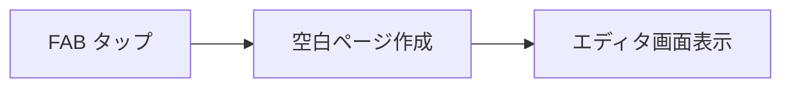
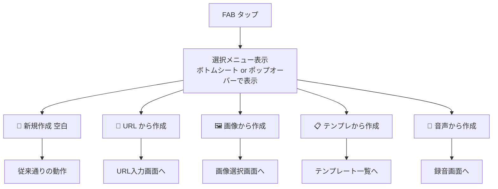
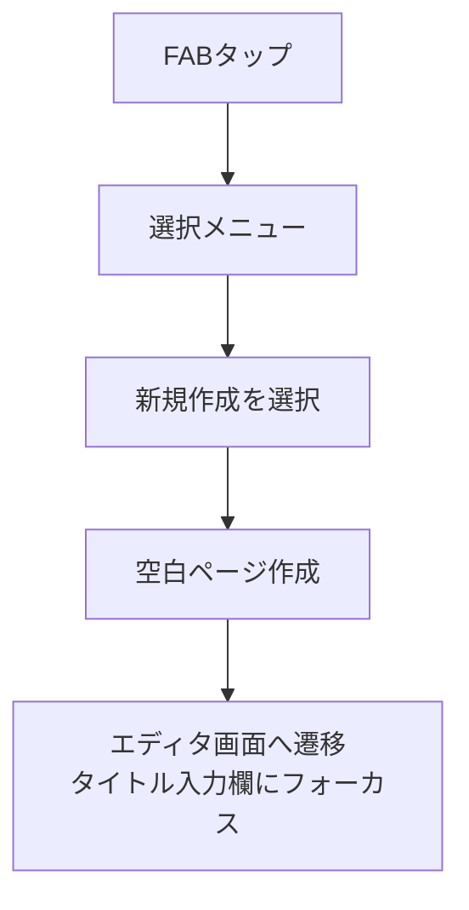
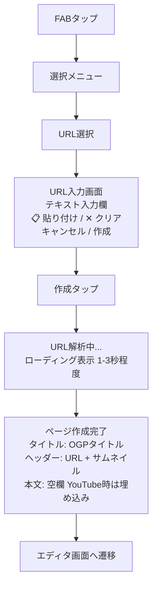
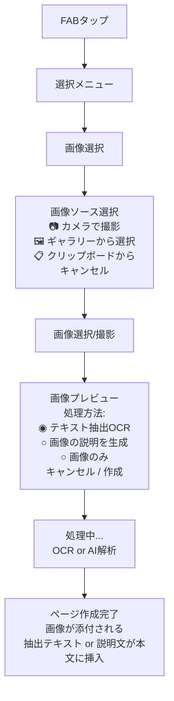

# FAB選択フロー設計

## 1. この機能について

### 1.1 背景と目的

現在のZediでは、画面右下のFAB（Floating Action Button）をタップすると即座に空白ページが作成されます。しかし、ユーザーがメモを作成する際には様々な「きっかけ」があります。

- 読んだ記事についてメモしたい → URLが起点
- 撮った写真を整理したい → 画像が起点
- いつもの形式で記録したい → テンプレートが起点
- 移動中に思いついたことをメモしたい → 音声が起点

この機能拡張により、**ユーザーの動機に合った方法でページ作成を開始できる**ようにします。

### 1.2 用語説明

| 用語 | 説明 |
|------|------|
| FAB (Floating Action Button) | 画面右下に常に表示される丸いボタン。現在は「+」アイコンで新規ページ作成に使用 |
| 起点 | ページ作成のきっかけとなる素材（URL、画像、テンプレート、音声など） |
| OGP (Open Graph Protocol) | WebページのタイトルやサムネイルなどのメタデータをSNS等で共有するための規格 |

---

## 2. ユーザーフロー全体像

### 2.1 現状（変更前）



**問題点**: 起点となる素材（URL等）がある場合、ページ作成後に手動で貼り付ける必要がある

### 2.2 変更後



---

## 3. 各選択肢の詳細

### 3.1 新規作成（空白）

**対象ユーザー**: とにかくすぐにメモを始めたい人、特定の起点がない人

#### ユーザーストーリー

> 「電車の中でふと思いついたアイデアをすぐにメモしたい。余計な手順は省いてすぐ書き始めたい」

#### 画面フロー



#### 動作仕様

| 項目 | 内容 |
|------|------|
| 作成されるページ | タイトル空欄、本文空欄の新規ページ |
| 遷移先 | PageEditorコンポーネント |
| フォーカス位置 | タイトル入力欄 |
| 保存タイミング | 自動保存（既存の動作を維持） |

#### 実装メモ

- 現行のFAB動作と全く同じ
- 既存ユーザーへの影響を最小限に抑えるため、この選択肢は常に最上部に配置

---

### 3.2 URL から作成

**対象ユーザー**: Web記事・YouTube動画など、オンラインコンテンツについてメモを取りたい人

#### ユーザーストーリー

**シナリオA: 技術記事について学習メモを作る**

> 1. Zedyで技術ブログを読んでいて、内容をメモしたいと思った
> 2. FABをタップ → 「URL」を選択
> 3. URL入力画面で、クリップボードにあるURLを貼り付け
> 4. 「作成」をタップ
> 5. ページが作成され、記事のタイトル・サムネイル・URLが自動で設定される
> 6. 記事の要点や自分の理解を本文に書き加える

**シナリオB: YouTube動画の内容を記録する**

> 1. 見たYouTube動画の内容をメモしたい
> 2. FABをタップ → 「URL」を選択
> 3. YouTube URLを貼り付け
> 4. ページが作成され、動画が埋め込まれる
> 5. 動画を見ながら気づいたことを追記

#### 画面フロー



#### 動作仕様

| 項目 | 内容 |
|------|------|
| 入力方式 | テキスト入力 or クリップボードから貼り付け |
| URL検証 | `https://` または `http://` で始まる有効なURL形式かチェック |
| 取得情報 | OGPタイトル、OGP説明文、OGP画像（サムネイル）、ファビコン |
| タイムアウト | 5秒（超過時は後述のフォールバック処理） |

#### コンテンツタイプ別の処理

| コンテンツ | 取得・表示内容 |
|-----------|---------------|
| **一般Webページ** | タイトル、説明、サムネイルを取得。ヘッダーにURL表示。 |
| **YouTube動画** | タイトル、サムネイル、チャンネル名を取得。本文に動画埋め込みブロックを挿入。 |
| **Twitter/X ポスト** | 投稿者名、投稿内容、添付画像を取得。埋め込みとして表示。 |
| **その他動画サイト** | OGP情報を取得。将来的に埋め込み対応を検討。 |

#### エラーハンドリング

| 状況 | ユーザーへの表示 | 内部処理 |
|------|-----------------|----------|
| 無効なURL形式 | 「有効なURLを入力してください」（赤字でリアルタイム表示） | 作成ボタンを非活性化 |
| 404エラー | 「ページが見つかりませんでした」 | URLのみでページ作成を提案 |
| タイムアウト | 「情報の取得に時間がかかっています」 | URLのみでページ作成、バックグラウンドで再取得 |
| OGP情報なし | （エラーなし） | URLとドメイン名のみでページ作成 |

#### 既存機能との連携

- `useWebClipper` フックを活用してOGP情報を取得
- 現行のページヘッダーURL機能（外部リンク表示）と統合

---

### 3.3 画像から作成

**対象ユーザー**: スクリーンショット、写真、書類などの画像からメモを作りたい人

#### ユーザーストーリー

**シナリオA: スクリーンショットからメモを作る**

> 1. 気になるツイートをスクリーンショットで保存した
> 2. FABをタップ → 「画像」を選択
> 3. ギャラリーからスクショを選択
> 4. OCRでテキストが抽出され、ページに挿入される
> 5. 自分のコメントを追記

**シナリオB: ホワイトボードを撮影してメモ化**

> 1. 会議でホワイトボードに書いた内容を残したい
> 2. FABをタップ → 「画像」を選択 → 「カメラ」を選択
> 3. ホワイトボードを撮影
> 4. 手書き文字がテキスト化される
> 5. 足りない内容を補足

**シナリオC: 風景写真にメモを添える**

> 1. 旅行先で撮った写真に説明を付けたい
> 2. FABをタップ → 「画像」を選択
> 3. 写真を選択（テキストがない画像）
> 4. AIが「海辺の夕焼け、遠くに灯台が見える」等の説明を生成
> 5. 自分の感想を追記

#### 画面フロー



#### 動作仕様

| 項目 | 内容 |
|------|------|
| 対応画像形式 | JPEG, PNG, GIF, WebP, HEIC |
| 最大ファイルサイズ | 10MB（超過時はリサイズ確認ダイアログ） |
| 画像の保存先 | ユーザーの画像ストレージ設定に従う（ローカル/クラウド） |

#### 処理モード

| モード | 処理内容 | 適したケース |
|--------|---------|-------------|
| **テキスト抽出（OCR）** | 画像内の文字を認識してテキスト化 | スクショ、書類、本のページ、手書きメモ |
| **画像説明生成** | AIが画像の内容を文章で説明 | 写真、イラスト、図表 |
| **画像のみ** | テキスト処理なし、画像だけを添付 | 加工不要で画像を残したい場合 |

#### エラーハンドリング

| 状況 | ユーザーへの表示 | 内部処理 |
|------|-----------------|----------|
| カメラ許可なし | 「カメラへのアクセスを許可してください」+ 設定へのリンク | 許可ダイアログを再表示 |
| OCR失敗/テキストなし | 「テキストを検出できませんでした」 | 画像説明生成 or 画像のみで作成を提案 |
| 画像が大きすぎる | 「画像サイズが大きいため、リサイズしますか？」 | 元サイズ/リサイズの選択肢を提示 |
| 非対応形式 | 「この画像形式には対応していません（JPEG, PNGをお使いください）」 | 作成不可 |

#### 既存機能との連携

- `useImageUpload` フックを活用
- 画像ストレージ設定（`StorageSettings`）と連携

---

## 4. UI/UX設計

### 4.1 FABメニューのデザイン

#### モバイル: ボトムシート形式

```
┌──────────────────────────────────────┐
│                                      │
│           （ページ一覧）              │
│                                      │
├──────────────────────────────────────┤ ← 半透明オーバーレイ
│  ┌────────────────────────────────┐  │
│  │  📝 新規作成                    │  │ ← 各行タップで選択
│  │  🔗 URLから作成                 │  │
│  │  🖼️ 画像から作成                │  │
│  │  📋 テンプレートから作成         │  │
│  │  🎤 音声から作成                │  │
│  ├────────────────────────────────┤  │
│  │  [キャンセル]                   │  │
│  └────────────────────────────────┘  │
└──────────────────────────────────────┘
```

#### デスクトップ: ポップオーバー形式

```
                              ┌─────────────────────┐
                              │ 📝 新規作成          │
                              │ 🔗 URLから           │
                              │ 🖼️ 画像から          │
                              │ 📋 テンプレートから   │
                              │ 🎤 音声から          │
                              └─────────────────────┘
                                        ▲
                                    ┌───────┐
                                    │  ＋   │ ← FAB
                                    └───────┘
```

### 4.2 操作性の考慮

| 考慮点 | 対応 |
|--------|------|
| 従来ユーザーへの配慮 | 「新規作成」を最上部に配置。迷わず従来通りの操作が可能 |
| ワンタップ追加の許容 | メニュー表示→選択の2タップになるが、起点選択のメリットが上回る |
| キーボードショートカット | デスクトップでは `Ctrl/Cmd + N` で新規作成（従来通り） |
| 最近使った起点 | （将来）最近使った起点を上部に表示するオプション |

---

## 5. 実装計画

### 5.1 優先順位

| 優先度 | 機能 | 理由 |
|--------|------|------|
| **P0** | FABメニュー化の基盤 | すべての機能の土台。これがないと他が実装できない |
| **P0** | 新規作成（空白） | 既存動作の維持。リグレッション防止 |
| **P1** | URLから作成 | 既存の`useWebClipper`を活用可能。開発コスト低 |
| **P2** | 画像から作成 | OCRサービス選定・連携が必要。中程度の開発コスト |
| **P3** | テンプレートから作成 | 別ドキュメントで詳細設計が必要 |
| **P3** | 音声から作成 | 別ドキュメントで詳細設計が必要 |

### 5.2 技術的な実装方針

#### FABメニューコンポーネント

```typescript
// 想定されるコンポーネント構成
<FAB onClick={openMenu}>
  <FABMenu isOpen={isMenuOpen}>
    <FABMenuItem icon={FileText} label="新規作成" onClick={createBlankPage} />
    <FABMenuItem icon={Link} label="URLから" onClick={openUrlInput} />
    <FABMenuItem icon={Image} label="画像から" onClick={openImagePicker} />
    <FABMenuItem icon={Layout} label="テンプレートから" onClick={openTemplateList} />
    <FABMenuItem icon={Mic} label="音声から" onClick={openVoiceRecorder} />
  </FABMenu>
</FAB>
```

#### 状態管理

- メニューの開閉状態はローカルstate（useState）で管理
- 選択後のモーダル/シート表示も同様にローカルstate
- 作成したページの保存は既存の `pageStore` を使用

---

## 6. 関連ドキュメント

| ドキュメント | 内容 |
|-------------|------|
| [テンプレートからページ作成](./template-creation.md) | テンプレート機能の詳細設計 |
| [音声からページ作成](./voice-creation.md) | 音声入力機能の詳細設計 |
| [AIエージェント機能](./ai-agent-feature.md) | AI対話からのページ作成 |
