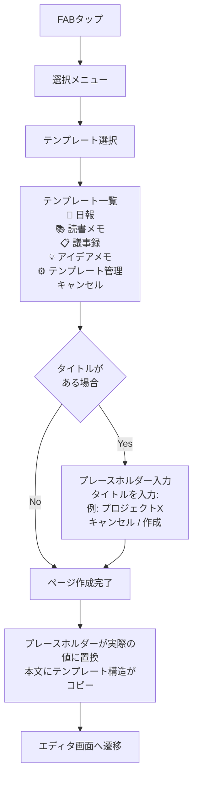
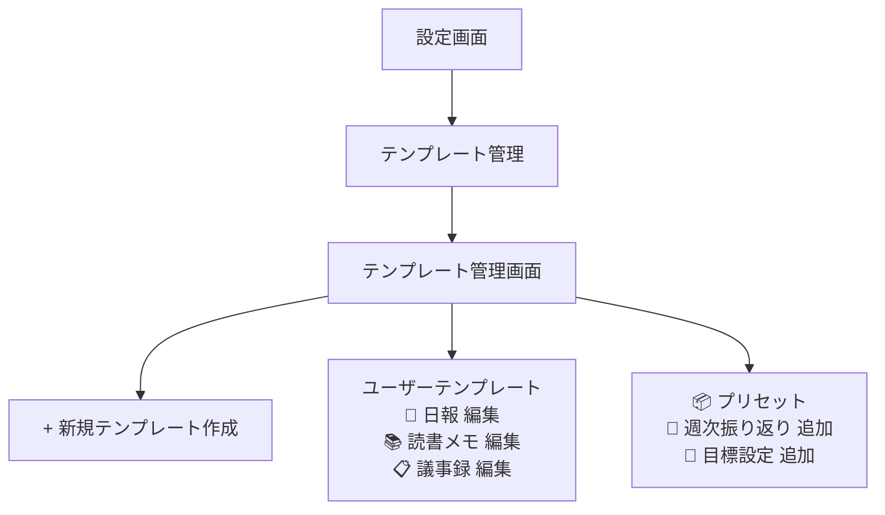
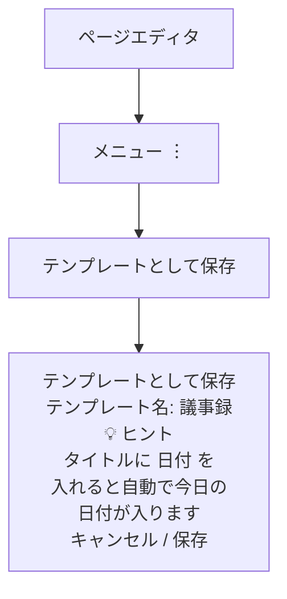

# テンプレートからページ作成

## 1. この機能について

### 1.1 背景と目的

メモを取る際、同じ構造を繰り返し使うケースがあります：

- 毎日書く日報（やったこと、わかったこと、次やること）
- 読書のたびに書く読書メモ（書名、著者、感想、引用）
- 定例会議の議事録（日時、参加者、議題、決定事項、TODO）

これらを毎回一から書くのは非効率です。**テンプレート機能**を使えば、あらかじめ定義した構造をワンタップで呼び出し、すぐに中身を書き始められます。

### 1.2 用語説明

| 用語 | 説明 |
|------|------|
| テンプレート | ページの雛形。タイトルの形式、見出し、箇条書きなどの構造があらかじめ定義されている |
| プレースホルダー | `{{日付}}` のような置き換え用の記号。ページ作成時に実際の値に自動変換される |
| プリセット | Zediがあらかじめ用意するテンプレート（日報、読書メモなど） |

### 1.3 ゴール

- ユーザーが自分専用のテンプレートを簡単に作成・管理できる
- テンプレートからワンタップでページを作成できる
- よく使う構造を何度も書く手間を省く

---

## 2. ユーザーストーリー

### ストーリー1: 日報テンプレートを使って毎日の振り返りを効率化

> **田中さん（エンジニア）の場合**
>
> 1. 仕事終わりに日報を書こうとFABをタップ
> 2. 「テンプレートから」を選択
> 3. 作成済みの「日報」テンプレートを選択
> 4. 以下の構造でページが作成される：
>    ```
>    # 2026-01-20 日報
>    
>    ## やったこと
>    - 
>    
>    ## わかったこと
>    - 
>    
>    ## 次やること
>    - 
>    ```
> 5. 日付は自動で今日の日付が入っている
> 6. 各セクションに内容を記入して完了

### ストーリー2: 読書メモのテンプレートを自分で作成する

> **鈴木さん（読書好き）の場合**
>
> 1. いつも使う読書メモの形式をテンプレート化したい
> 2. 設定画面 → テンプレート管理 を開く
> 3. 「新規テンプレート作成」をタップ
> 4. 以下の内容でテンプレートを作成：
>    ```
>    # 📚 {{タイトル}}
>    
>    **著者**: 
>    **読了日**: {{日付}}
>    
>    ## 概要
>    
>    ## 印象に残った言葉
>    > 
>    
>    ## 学んだこと
>    - 
>    
>    ## アクションアイテム
>    - [ ] 
>    ```
> 5. テンプレート名を「読書メモ」として保存
> 6. 次回から「読書メモ」テンプレートを選ぶだけでこの形式で書き始められる

### ストーリー3: 既存のページをテンプレート化する

> **山田さん（プロジェクトマネージャー）の場合**
>
> 1. 過去に作成した「プロジェクトキックオフ」ページの形式を使い回したい
> 2. そのページを開く → メニュー → 「テンプレートとして保存」
> 3. テンプレート名を入力して保存
> 4. 次のプロジェクト開始時に、このテンプレートを使ってすぐに始められる

---

## 3. 画面フロー

### 3.1 テンプレートからページを作成する



### 3.2 テンプレートを作成・管理する



### 3.3 既存ページからテンプレートを作成する



---

## 4. テンプレートの仕様

### 4.1 テンプレートに含まれる情報

| 項目 | 説明 | 例 |
|------|------|-----|
| **テンプレート名** | 一覧に表示される名前 | 「日報」「読書メモ」 |
| **アイコン** | 視覚的に識別するためのアイコン（任意） | 📝, 📚, 📋 |
| **タイトルテンプレート** | ページタイトルの雛形 | `{{日付}} 日報` → `2026-01-20 日報` |
| **本文テンプレート** | ページ本文の雛形 | 見出し、箇条書きなど |
| **デフォルトタグ** | 自動で付与するタグ（任意） | `日報`, `振り返り` |

### 4.2 プレースホルダー

ページ作成時に自動的に置き換えられる特殊な記号です。

#### 自動置換されるプレースホルダー

| プレースホルダー | 置換結果 | 例 |
|-----------------|---------|-----|
| `{{日付}}` | 今日の日付（YYYY-MM-DD形式） | `2026-01-20` |
| `{{日付:YYYY年MM月DD日}}` | カスタム形式の日付 | `2026年01月20日` |
| `{{時刻}}` | 現在時刻（HH:mm形式） | `14:30` |
| `{{曜日}}` | 今日の曜日 | `月曜日` |
| `{{年}}` | 今年の年 | `2026` |
| `{{月}}` | 今月 | `1` |

#### 入力を求めるプレースホルダー

| プレースホルダー | 動作 |
|-----------------|------|
| `{{タイトル}}` | ページ作成前に入力ダイアログを表示 |
| `{{書名}}` | 同上（表示ラベルをカスタマイズ可能） |

#### プレースホルダーの使用例

**テンプレート定義:**
```markdown
# 📚 {{書名}}

**著者**: 
**読了日**: {{日付}}

## 感想

## 引用
> 
```

**作成時の入力:**
- 書名の入力を求められる → 「アトミック・ハビット」と入力

**生成されるページ:**
```markdown
# 📚 アトミック・ハビット

**著者**: 
**読了日**: 2026-01-20

## 感想

## 引用
> 
```

### 4.3 テンプレートの保存場所

テンプレートは以下のように管理されます：

| 種類 | 保存場所 | 編集 | 削除 |
|------|---------|------|------|
| ユーザー作成 | ユーザーのデータベース内 | 可能 | 可能 |
| プリセット | アプリ内蔵 | 不可（コピーして編集） | 不可（非表示のみ） |

---

## 5. ユースケース別テンプレート例

### 5.1 プリセットとして提供を検討するテンプレート

| カテゴリ | テンプレート名 | 用途 |
|---------|---------------|------|
| **仕事** | 日報 | 毎日の振り返り |
| | 週次振り返り | 週の振り返りと来週の計画 |
| | 議事録 | 会議の記録 |
| | 1on1メモ | 1対1ミーティングの記録 |
| **学習** | 読書メモ | 本の内容と感想 |
| | 学習ノート | 新しく学んだことの整理 |
| | 講義メモ | 授業やセミナーの記録 |
| **個人** | アイデアメモ | 思いつきの整理 |
| | 目標設定 | 目標とアクションプラン |
| | 旅行計画 | 旅行の準備と記録 |

### 5.2 日報テンプレート（プリセット例）

```markdown
# {{日付}} 日報

## ✅ やったこと
- 

## 💡 わかったこと
- 

## 📝 次やること
- 

## 📌 メモ

```

### 5.3 読書メモテンプレート（プリセット例）

```markdown
# 📚 {{書名}}

**著者**: 
**読了日**: {{日付}}

## 📖 概要
この本は〜について書かれた本。

## ✨ 印象に残った言葉
> 

## 💡 学んだこと
- 

## 🎯 アクションアイテム
- [ ] 

## 🔗 関連するメモ

```

---

## 6. エラーハンドリング

| 状況 | ユーザーへの表示 | 内部処理 |
|------|-----------------|----------|
| テンプレートが0件 | 「テンプレートがありません。作成するか、プリセットを追加しましょう」 | プリセット一覧を表示 |
| 選択したテンプレートが削除済み | 「このテンプレートは削除されました」 | 一覧を再読み込み |
| テンプレート保存失敗 | 「保存に失敗しました。もう一度お試しください」 | 入力内容を保持したまま再試行可能に |
| プレースホルダー入力がキャンセルされた | （何もせず一覧に戻る） | 作成処理を中断 |

---

## 7. 実装計画

### 7.1 フェーズ分け

#### Phase 1: MVP（最小限の機能）

**スコープ:**
- テンプレート一覧からページ作成
- 既存ページを「テンプレートとして保存」
- 基本的なプレースホルダー（`{{日付}}`, `{{タイトル}}`）
- テンプレートの編集・削除

**スコープ外:**
- プリセットテンプレート
- 高度なプレースホルダー
- テンプレート共有

#### Phase 2: 拡張機能

- プリセットテンプレートの提供
- 追加のプレースホルダー（曜日、カスタム日付形式など）
- テンプレートの並び替え
- デフォルトタグの設定

#### Phase 3: 発展機能

- テンプレートのインポート/エクスポート
- ユーザー間でのテンプレート共有
- AIによるテンプレート提案

### 7.2 データモデル（案）

```typescript
interface Template {
  id: string;
  name: string;                    // テンプレート名
  icon?: string;                   // アイコン（絵文字）
  titleTemplate: string;           // タイトルの雛形
  bodyTemplate: string;            // 本文の雛形
  defaultTags?: string[];          // デフォルトタグ
  isPreset: boolean;               // プリセットかどうか
  createdAt: string;
  updatedAt: string;
}
```

### 7.3 既存機能との連携

| 既存機能 | 連携内容 |
|---------|---------|
| PageEditor | テンプレートから作成したページの編集 |
| pageStore | テンプレートの保存・読み込み |
| 設定画面 | テンプレート管理へのリンク追加 |
| FABメニュー | テンプレート選択肢の追加 |

---

## 8. 未決定事項

以下の項目は実装時に決定が必要です：

| 項目 | 選択肢 | 判断基準 |
|------|--------|---------|
| テンプレート編集UI | 専用エディタ vs 通常ページと同じUI | 開発コストとUXのバランス |
| プリセットの数 | 最小限（3-5個） vs 充実（10+個） | ユーザーリサーチの結果 |
| アイコン選択方法 | 絵文字入力 vs アイコンピッカー | 実装コスト |
| テンプレートの上限数 | 無制限 vs 制限あり | ストレージ・パフォーマンスへの影響 |

---

## 9. 関連ドキュメント

| ドキュメント | 内容 |
|-------------|------|
| [FAB選択フロー設計](./fab-selection-flow.md) | FABメニュー全体の設計 |
| [音声からページ作成](./voice-creation.md) | 音声入力機能の詳細設計 |
| [AIエージェント機能](./ai-agent-feature.md) | AI対話からのページ作成 |
