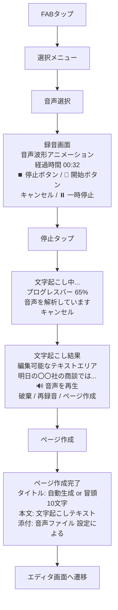
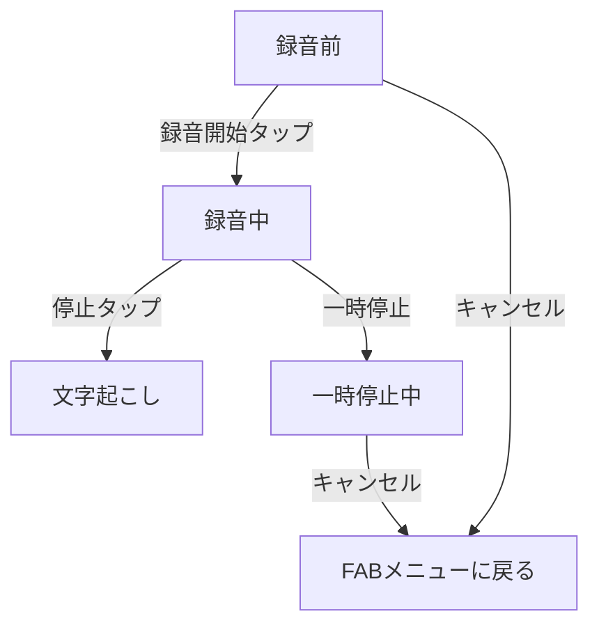
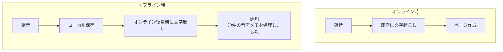

# 音声からページ作成

## 1. この機能について

### 1.1 背景と目的

「メモしたい」と思った瞬間にキーボードを使えないシーンがあります：

- 通勤中の電車内で思いついたアイデア
- 運転中にふと浮かんだタスク
- 料理中に見たレシピのメモ
- 散歩中の読書音声を聞きながらの気づき

このような場面で、**声でメモを残し、自動でテキスト化する機能**があれば、思いつきを逃さず記録できます。

### 1.2 用語説明

| 用語 | 説明 |
|------|------|
| 文字起こし | 音声をテキストに変換すること。Speech-to-Text とも呼ばれる |
| リアルタイム文字起こし | 話しながら同時にテキストが表示される方式 |
| バッチ処理 | 録音完了後にまとめてテキスト変換する方式 |
| Whisper | OpenAIが開発した高精度な音声認識モデル |
| Web Speech API | ブラウザ標準の音声認識API（Chrome中心で対応） |

### 1.3 ゴール

- 声だけでメモを作成できる
- 文字起こし結果を編集してページとして保存できる
- 手が使えない状況でも思いつきを逃さない

---

## 2. ユーザーストーリー

### ストーリー1: 移動中に思いついたアイデアをメモする

> **佐藤さん（営業職）の場合**
>
> 1. 電車での移動中、次の商談のアイデアを思いついた
> 2. スマホを取り出し、Zediを開いてFABをタップ
> 3. 「音声から」を選択
> 4. 大きな録音ボタンをタップして話し始める:
>    「明日の〇〇社の商談では、まず先方の課題をヒアリングして、それから...」
> 5. 話し終わったら停止ボタンをタップ
> 6. 数秒で文字起こしが完了
> 7. 誤変換を修正してページ保存
> 8. 商談前に見返して準備に活用

### ストーリー2: 運転中のタスクメモ

> **田中さん（フリーランス）の場合**
>
> 1. 運転中に「あ、あれやらなきゃ」と思い出した
> 2. 信号待ちでZediを開き、FAB → 「音声から」
> 3. ハンズフリーで録音開始
> 4. 「クライアントAに見積もり送る。あと、確定申告の書類を準備する」
> 5. 目的地で文字起こし結果を確認
> 6. タスクページとして保存、後でTODOリストに転記

### ストーリー3: 会議の要点をボイスメモ

> **山本さん（プロダクトマネージャー）の場合**
>
> 1. 会議が終わった直後、要点をすぐにメモしたい
> 2. 席を立ちながらFAB → 「音声から」
> 3. 「今の会議で決まったこと。リリース日は来月15日。優先機能はAとBで、Cは次フェーズ。担当は...」
> 4. 5分ほど話して録音終了
> 5. 文字起こしを確認、見出しを追加して整形
> 6. 「2026-01-20 企画会議」として保存

---

## 3. 画面フロー

### 3.1 音声からページを作成する流れ



### 3.2 各画面の状態

#### 録音画面の状態遷移



#### 録音中の表示要素

| 要素 | 説明 |
|------|------|
| 波形アニメーション | 音声入力があることを視覚的にフィードバック |
| 経過時間 | `MM:SS` 形式で表示。上限に近づくと色が変わる |
| 停止ボタン | 大きく目立つ位置に配置 |
| 一時停止ボタン | 録音を一時中断したい場合に使用 |
| キャンセルボタン | 録音を破棄してメニューに戻る |

---

## 4. 機能仕様

### 4.1 入力方式

| 方式 | 説明 | サポート状況 |
|------|------|-------------|
| **リアルタイム録音** | アプリ内で直接録音 | Phase 1から対応 |
| **音声ファイル選択** | 既存の音声ファイルを読み込み | Phase 2から対応 |
| **共有メニュー経由** | 他アプリから音声ファイルを共有 | 将来検討 |

### 4.2 録音の制限

| 項目 | Phase 1 | Phase 2 | 理由 |
|------|---------|---------|------|
| 最大録音時間 | 5分 | 30分 | 処理コストとユースケースのバランス |
| 音声形式 | WebM | WebM, MP3, WAV | ブラウザ対応と汎用性 |
| 対応ブラウザ | Chrome優先 | 主要ブラウザ | Web Speech API の対応状況 |

### 4.3 文字起こしサービス

#### Phase 1: Web Speech API（無料）

| 特性 | 内容 |
|------|------|
| コスト | 無料 |
| 精度 | 中程度（日常会話レベル） |
| 対応言語 | 日本語含む多言語 |
| 動作環境 | Chrome（オンライン必須） |
| リアルタイム | 対応 |

#### Phase 2: Whisper API（高精度）

| 特性 | 内容 |
|------|------|
| コスト | 従量課金（$0.006/分） |
| 精度 | 高（専門用語も認識） |
| 対応言語 | 50以上の言語 |
| 動作環境 | オンライン必須 |
| リアルタイム | 非対応（バッチ処理） |

#### ユーザーへの選択肢提供（将来）

```
[音声認識エンジン設定]

◉ 標準（無料）
  - Web Speech API を使用
  - 基本的な文字起こしに対応

○ 高精度（Whisperを使用）
  - より正確な認識が可能
  - 録音1分あたり約1円の費用がかかります
```

### 4.4 音声ファイルの保存

| オプション | 動作 | メリット/デメリット |
|-----------|------|-------------------|
| **保存しない**（デフォルト） | 文字起こし完了後に音声を破棄 | ストレージ節約 / 後から聞き直せない |
| **保存する** | ページに音声ファイルを添付 | 聞き直し可能 / ストレージ消費 |

Phase 1ではシンプルに「保存しない」のみ対応し、Phase 2で選択制にします。

---

## 5. エラーハンドリング

### 5.1 録音開始時のエラー

| 状況 | ユーザーへの表示 | 対処 |
|------|-----------------|------|
| マイク許可なし | 「マイクへのアクセスを許可してください」+ 設定ボタン | 許可ダイアログを表示、または設定画面への誘導 |
| マイクが使用中 | 「マイクが他のアプリで使用されています」 | 他アプリを閉じるよう案内 |
| ブラウザ非対応 | 「このブラウザでは音声入力に対応していません。Chromeをお使いください」 | Chromeダウンロードへのリンク |

### 5.2 録音中のエラー

| 状況 | ユーザーへの表示 | 対処 |
|------|-----------------|------|
| 録音時間上限到達 | 「録音時間の上限（5分）に達しました」 | 自動で録音停止、文字起こしへ進む |
| 無音が続く | 「音声が検出されていません。マイクを確認してください」 | 警告表示（録音は継続） |
| 録音失敗 | 「録音に失敗しました。もう一度お試しください」 | 録音画面に戻る |

### 5.3 文字起こし時のエラー

| 状況 | ユーザーへの表示 | 対処 |
|------|-----------------|------|
| ネットワークエラー | 「インターネット接続を確認してください」 | 再試行ボタンを表示 |
| サービスエラー | 「文字起こしサービスが一時的に利用できません」 | 音声ファイルを保持し、後で再処理可能に |
| 認識失敗 | 「音声を認識できませんでした」 | 再録音を促す、または手動入力へ |
| タイムアウト | 「処理に時間がかかっています...」 | 待機継続 or キャンセルの選択肢 |

---

## 6. 想定されるユースケースと適合性

| ユースケース | 想定録音時間 | 適合度 | 備考 |
|-------------|-------------|--------|------|
| 思いつきメモ | 〜1分 | ⭐⭐⭐ | Phase 1で十分対応可能 |
| 買い物リスト | 〜2分 | ⭐⭐⭐ | 短文の羅列、認識精度は十分 |
| 日記・振り返り | 5〜10分 | ⭐⭐ | Phase 2で対応範囲拡大 |
| 会議メモ | 10〜30分 | ⭐⭐ | Phase 2で対応、要点のみ推奨 |
| 講義録音 | 1時間〜 | ⭐ | Phase 3以降、分割対応が必要 |
| インタビュー | 30分〜 | ⭐ | 専用ツールの利用を推奨 |

---

## 7. UI/UXデザイン

### 7.1 録音ボタンのデザイン

```
録音前:                    録音中:
  ┌─────────┐             ┌─────────┐
  │         │             │         │
  │   🎤    │    ──→      │   ⏹️    │
  │         │             │   (赤)   │
  └─────────┘             └─────────┘
   灰色の円                  赤い円
   大きくタップしやすい       パルスアニメーション
```

### 7.2 アクセシビリティ考慮

| 項目 | 対応 |
|------|------|
| ボタンサイズ | 最小44x44pt（タップターゲット） |
| 色のコントラスト | 録音中は赤で明確に識別 |
| フィードバック | 視覚（波形）+ 触覚（バイブレーション） |
| 代替入力 | 音声が使えない場合はテキスト入力に切り替え可能 |

### 7.3 操作フローの最適化

| 操作 | 最適化 |
|------|--------|
| 録音開始 | FAB → 音声 → 1タップで録音開始（計3タップ） |
| 録音終了 | 停止ボタン1タップ |
| ページ保存 | 「ページ作成」1タップ（編集不要な場合） |
| 総タップ数 | 最短5タップでページ作成完了 |

---

## 8. 技術的な検討事項

### 8.1 ブラウザAPI対応状況

| API | Chrome | Safari | Firefox | Edge |
|-----|--------|--------|---------|------|
| MediaRecorder | ✅ | ✅ | ✅ | ✅ |
| Web Speech API | ✅ | ⚠️ 制限あり | ❌ | ✅ |
| AudioWorklet | ✅ | ✅ | ✅ | ✅ |

**結論**: Phase 1はChrome優先で開発し、Phase 2以降でクロスブラウザ対応（Whisper API利用）

### 8.2 音声フォーマット

| 形式 | サイズ | 品質 | ブラウザ対応 |
|------|--------|------|-------------|
| WebM (Opus) | 小 | 良 | Chrome, Firefox, Edge |
| MP3 | 中 | 良 | 全ブラウザ |
| WAV | 大 | 高 | 全ブラウザ（非推奨） |

**結論**: 録音はWebM、アップロード時はMP3変換をオプション提供

### 8.3 オフライン対応（Phase 3）



---

## 9. 実装計画

### 9.1 Phase 1: MVP

**スコープ:**
- リアルタイム録音（最大5分）
- Web Speech API による文字起こし
- 文字起こし結果の編集
- ページ作成

**非スコープ:**
- 音声ファイルの保存
- 音声ファイル選択
- Whisper API連携
- オフライン対応

**技術要件:**
- MediaRecorder API
- Web Speech API
- Chrome優先対応

### 9.2 Phase 2: 拡張

**追加機能:**
- 録音時間延長（30分）
- Whisper API 連携（ユーザー選択）
- 音声ファイル保存オプション
- 外部音声ファイル選択
- Safari/Firefox対応

### 9.3 Phase 3: 発展

**追加機能:**
- リアルタイム文字表示（話しながらテキスト表示）
- 話者分離（複数人の会話を識別）
- AI要約（長い録音を自動で構造化）
- オフライン対応（ローカルWhisper）

---

## 10. 関連ドキュメント

| ドキュメント | 内容 |
|-------------|------|
| [FAB選択フロー設計](./fab-selection-flow.md) | FABメニュー全体の設計 |
| [テンプレートからページ作成](./template-creation.md) | テンプレート機能の詳細設計 |
| [AIエージェント機能](./ai-agent-feature.md) | AI対話からのページ作成 |
