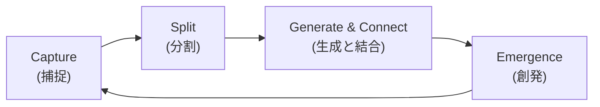

# Product Requirements Document (PRD): Zedi

| 項目 | 内容 |
| :--- | :--- |
| **Product Name** | **Zedi** |
| **Version** | **2.0 (Unified PRD)** |
| **Platform** | Desktop (Windows, macOS, Linux), Mobile (iOS, Android) |
| **Core Concept** | **"Zero-Friction Knowledge Network"**<br>「書くストレス」と「整理する義務」からの解放。<br>AIによる足場（Scaffolding）生成と、自然発生的なリンク構造により、思考を宇宙のように拡張する。 |
| **Target User** | 思考のネットワーク化を重視しつつも、記述コストを極限まで下げたいアーキテクト、研究者、高度ナレッジワーカー。 |

---

## 1. 製品ビジョンと体験 (UX Philosophy)

### 1.1 デザイン原則

1. **Speed & Flow (思考の速度):**
   - 起動は0秒を目指す。思考を妨げる「保存」「同期待ち」「整理」の手間を排除する。
   - 入力までのタップ数・キーストロークを最小化する。

2. **Context over Folder (文脈による整理):**
   - フォルダによる階層化を行わない。情報は「時間（いつ生まれたか）」と「リンク（何に関連するか）」によってのみ整理される。

3. **Atomic & Constraint (原子性と制約):**
   - 1つのメモは1つのアイデア（カード）に限定する。
   - 長文を書くのではなく、小さなカードをリンクで繋ぐことを推奨するUI。

4. **Scaffolding by AI (足場としてのAI):**
   - ユーザーに白紙の恐怖を与えない。
   - AIは「正解」を書くためではなく、ユーザーがリンクを繋げるための「点（ノード）」を瞬時に生み出す役割を担う。

5. **Dormant Seeds (死蔵の許容):**
   - リンクされていないメモは「ゴミ」ではなく「発芽待ちの種」。
   - 無理に整理させず、将来的なネットワーク接続（Emergent Linking）を待つ。

6. **Local-First & Conflict-Free (完全な所有):**
   - 常にローカルで動作し、CRDT技術によりオフライン・複数デバイス間でも数学的に矛盾なく同期される。

### 1.2 主要なユーザーフロー (The Neural Loop)



1. **Capture (捕捉):**
   - **Desktop:** ホットキー一発（例: `Alt+Space`）で即座にカードエディタを開く。
   - **Mobile:** アプリ起動時の「Time Axis」で即座に入力、またはOS標準の共有機能（Share Sheet）からブラウザ等の情報を直接カードとして放り込む。

2. **Split (分割):**
   - **Mobile:** 段落を「右フリック」(Flick-to-Split) して切り出し、即座に独立したカードへ変換。
   - **Desktop:** テキストブロックをドラッグして別パネルへ (Magic Split)。
   - **Result:** どちらもAIが文脈を読み、適切なタイトルを自動付与して保存。

3. **Generate & Connect (生成と結合):**
   - 未知の概念や、体系化したいキーワードを選択し「Wiki Generate」を実行。
   - AIが解説と共に「関連するキーワードへの空リンク」を含んだ状態でテキストを生成。
   - ユーザーはこの「AIが作った足場」を飛び石のように使い、自分の思考を追記・接続していく。

4. **Emergence (創発):**
   - `[[未作成のリンク]]` が複数のカードに登場した瞬間、システムがそれを「重要なトピック」と認識し、実体のあるカードとして自動生成する。

---

## 2. 機能要件 (Functional Requirements)

### 2.1 起動とアクセシビリティ

| Platform | 機能 |
| :--- | :--- |
| **Desktop** | グローバルホットキー（例: `Alt+Space`）によるクイック入力ウィンドウ呼び出し。システムトレイ常駐によるバックグラウンド待機。 |
| **Mobile** | Tauri 2.0最適化によるコールドスタート高速化。ホーム画面ウィジェット、共有メニュー（Share Extension）からのテキスト取り込み。 |

### 2.2 ナビゲーションと構造

#### Time Axis (Default View / Stream View)
- アプリ起動時のホーム画面。SNSのフィードのように、作成・更新された「カード」が時系列（降順）で並ぶ。
- 「今日考えたこと」「昨日書いたこと」が自然と目に入るフロー型UI。
- Share Sheet経由で追加されたカードもここに流れてくる。
- **Filter機能:** 「孤立したカード（Unlinked）」のみを表示するフィルタにより、庭いじり（Gardening）をしたい時のニーズに応える。

#### Workspace / Filter
- 物理フォルダは存在しないが、「仕事」「個人」などのタグ/属性によるフィルタリングビューを提供。
- エントリーポイント（ビュー）を作成し、表示フィルタリングが可能。

#### Ghost Link System
- 実体（ファイル）が存在しないリンク `[[Concept X]]` を許容する。
- 同一のGhost Linkが **N回以上**（設定可能、デフォルト3回）異なるカードで使用された場合、自動的にカードを作成し、言及されているバックリンクを集約して表示する。

### 2.3 エディタ機能 (Frictionless Card Editor)

#### Card UI Metaphor
- 「白いA4用紙」ではなく「角丸のカード」としてデザイン。
- **Soft Limit:** 1画面に収まる分量（スクロール不要な範囲、約500-1000字）を推奨。
- 長くなるとリングインジケーターの色が変化し、心理的に要約や分割を促す（入力ブロックはしない）。

#### Editor Core (Solid-Tiptap)
- Solid.js + Tiptap (Prosemirror) を採用し、Markdown互換かつリッチな編集体験を提供。
- **サポート要素:**
  - テキスト: H1-H3, Quote, List (Bullet, Numbered, Toggle), Code Block
  - メディア埋め込み: 画像, 動画, 音声, PDF
  - **※手書き描画は非対応**

#### Smart Splitting

| Platform | 操作 | 詳細 |
| :--- | :--- | :--- |
| **Mobile** | **Flick-to-Split** | 任意の段落を右フリック（またはロングプレスからのスワイプ）して切り出し、新規カード作成へ遷移。 |
| **Desktop** | **Magic Split** | 選択したテキストブロックを、カードの外（余白部分）や別のPane領域へドラッグ＆ドロップして新規カード化。 |

- **Auto Link:** 元の場所には自動的に `[[New Card Title]]` のリンクが残る。
- **AI Titling:** 切り出されたテキストの内容を解析し、AIが適切な「タイトル案」を即座に生成・入力済み状態にする。

### 2.4 リンク機能

#### Internal Links
- `[[Page Title]]` 記法による相互リンク。
- テキスト中のキーワードを選択し、既存カードへリンクまたは新規カード作成。

#### Link Suggestions (Rust Backend)
- **ロジック:** Aho-Corasick法により、入力中のテキストにある「既存のカードタイトル」をリアルタイム検知（100ms以内）。
- **UI:** 該当箇所を「点線アンダーライン」でハイライト。クリックで `[[  ]]` リンクへ変換。**自動リンク化はしない。**

#### Backlinks & 2-hop Links (Footer UI)
- **Direct Links:** このカードがリンクしている先。
- **Backlinks:** このカードにリンクしている元。
- **Grandchild Links (2-hop):** リンク先のカードが、さらにどこへリンクしているかを表示。

### 2.5 AI機能 (Structural Intelligence) - BYOK: Bring Your Own Key

#### 設定
- ユーザーが自身のOpenAI / Anthropic APIキーを入力・保存する。
- 軽量タスク（タイトル生成等）はローカルLLM、重いタスクはAPI利用を選択可能に。

#### AI Node Scaffolding (Wiki Generator)
- **Trigger:** `/wiki` コマンド、または選択範囲メニュー。
- **Action:** 選択単語に対し、LLMが「定義」だけでなく**「派生する関連トピックへのリンク ([[Topic A]], [[Topic B]])」**を含んだ状態でテキストを生成する。
- **制約:** AIは長文記事ではなく、「1枚のカード（要約）」を生成して保存する。
- **Value:** ユーザーはAIが書いた内容を読むだけでなく、そこに含まれるリンクをクリックすることで、さらに新しいカードを作成・拡張できる（ネットワークの強制拡大）。

#### Contextual Titling
- Split操作時に、切断された前後の文脈を読んでタイトルを付ける。

#### Chat Search (RAG)
- ユーザーの承認のもと、Embedding APIを使用してローカル/リモートDBのベクトル化を行う。
- チャット形式で過去のメモを検索可能。

### 2.6 検索と再発見 (Hybrid Retrieval)

#### Global Search (Omni-bar)
- **Trigger:** Desktop は `Cmd+K` / `Ctrl+P`、Mobile はフロー画面上部の検索アイコンから起動。
- **Logic:** Rust (Tantivy) によるインメモリ全文検索。

#### Hybrid Search Engine
| 検索方式 | 説明 |
| :--- | :--- |
| **Keyword Search** | Rust (Tantivy) による高速な完全一致・部分一致検索。 |
| **Semantic Search** | ローカルEmbeddingモデル（all-MiniLM-L6-v2等の軽量モデル）をONNXで動作させ、単語が一致しなくても「意味が近い」カードをヒットさせる。 |

#### Smart Snippet
- **Context Aware:** 単にキーワード周辺を切り取るだけでなく、「文単位」または「段落単位」で意味が通じる範囲をスニペットとして表示する。
- **Dynamic Highlighting:** ヒットしたキーワードをハイライトしつつ、その前後にある関連性の高い文脈も保持して表示する。
- ユーザーがカードを開かなくても「何を書いたか」を思い出せる品質を目指す。

### 2.7 モバイル統合 (Mobile Integration)

#### Share Sheet Extension
- iOS/AndroidのOS標準共有メニューに「Zedi」を表示。
- Webページや他アプリのテキストを共有した際、Zediアプリを開かずにバックグラウンドで新規カードを作成し保存する。
- 保存されたカードは自動的に `Inbox` タグが付与され、Time Axisの最上部に現れる。

### 2.8 オンボーディング (Seed Content)

#### Tutorial as Cards
- インストール直後の「空っぽ（Cold Start）」状態を防ぐため、チュートリアル自体を実際の「カードデータ」としてプリセットする。
- **内容例:**
  - 「👋 Zediへようこそ」（操作説明）
  - 「🔗 リンクの繋ぎ方」（別カードへのリンク実例）
  - 「🤖 AIの使い方」（AI機能のデモ用カード）
  - 「✨ Magic Splitを試そう」（分割機能のデモ）
- ユーザーはこれらのカードを読み、編集し、リンクを辿ることで自然に操作を学習できる。

### 2.9 認証と同期

#### Authentication
- Supabase Auth (Google OAuth, Passkeys) による認証。

#### Sync Strategy (CRDT)
- **Algorithm:** CRDT (Conflict-free Replicated Data Types) を採用。CR-SQLiteを使用。
- **Behavior:** 「競合」が発生しない。オフライン中にPCとスマホで同じカードを編集しても、文字単位・ブロック単位で自動的にマージされる。

#### Local-First
- 全データはローカルSQLiteにあり、ネットワーク接続時にSupabase (PostgreSQL) とバックグラウンドで差分同期する。
- 読み書きは常にローカルに対して行われる。

---

## 3. 技術スタックとアーキテクチャ

### 3.1 Tech Stack

| 領域 | 技術選定 | 選定理由 |
| :--- | :--- | :--- |
| **Frontend** | **Solid.js** | 仮想DOMレスによる世界最速クラスの描画パフォーマンス。大量のカードを表示してもFPSを落とさない。 |
| **Editor Core** | **solid-tiptap** | Prosemirrorベースの拡張性とSolid.jsのReactivityの融合。Magic Split等のD&D操作の実装容易性。 |
| **App Framework** | **Tauri 2.0** | Rustバックエンドによる堅牢性、セキュリティ。WebView利用による軽量・クロスプラットフォーム対応（Mobile含む）。 |
| **Local DB** | **SQLite + CR-SQLite** | オフライン動作の基盤。CRDT拡張を組み込み、分散データベースとして機能させる。 |
| **Remote DB / Auth** | **Supabase** | PostgreSQL + pgvector (AI用) + Edge Functions。Auth認証およびCRDTメッセージの仲介（Signaling）と永続化ストレージ。 |
| **Search & Vector** | **Rust (Tantivy + ort)** | 全文検索とベクトル検索(ONNX Runtime)をRust側で統合し、高速かつオフラインで「意味的検索」を実現。 |
| **Algorithm** | **Rust (Aho-Corasick)** | リンク候補マッチング処理の高速実行。 |

### 3.2 データモデル (CRDT Schema)

```sql
-- CRR (Conflict-free Replicated Relations) 対応テーブル
-- CR-SQLite経由で管理される

-- 1. ワークスペース/ビュー定義
CREATE TABLE workspaces (
    id TEXT PRIMARY KEY,
    user_id TEXT NOT NULL,
    name TEXT NOT NULL,
    icon TEXT,
    created_at INTEGER
);
SELECT crsql_as_crr('workspaces');

-- 2. カード（情報の最小単位）
CREATE TABLE cards (
    id TEXT PRIMARY KEY,
    user_id TEXT NOT NULL,
    workspace_id TEXT,           -- 所属ビュー（オプション）
    title TEXT,
    content TEXT,                -- Tiptap JSON (CRDT管理対象)
    vector BLOB,                 -- Embedding Vector
    created_at INTEGER,          -- Time Axisソート用
    updated_at INTEGER,
    is_deleted BOOLEAN DEFAULT 0
);
CREATE INDEX idx_cards_title ON cards(title);
CREATE INDEX idx_cards_created_at ON cards(created_at);
SELECT crsql_as_crr('cards');

-- 3. リンク関係（グラフ構造）
CREATE TABLE links (
    source_id TEXT NOT NULL,
    target_id TEXT NOT NULL,
    created_at INTEGER,
    FOREIGN KEY(source_id) REFERENCES cards(id),
    FOREIGN KEY(target_id) REFERENCES cards(id),
    PRIMARY KEY (source_id, target_id)
);
SELECT crsql_as_crr('links');

-- 4. Ghost Links（未作成リンクのトラッキング）
CREATE TABLE ghost_links (
    link_text TEXT NOT NULL,         -- リンクテキスト（例: "Concept X"）
    source_card_id TEXT NOT NULL,    -- 使用しているカードID
    created_at INTEGER,
    PRIMARY KEY (link_text, source_card_id)
);
SELECT crsql_as_crr('ghost_links');
```

---

## 4. 非機能要件 (Non-Functional Requirements)

### 4.1 Performance

| 項目 | 目標値 |
| :--- | :--- |
| **起動時間** | Desktop 0.5秒以内（常駐時は0秒）、Mobile 1.0秒以内（コールドスタート） |
| **入力遅延** | 数万枚のカードが存在しても入力にラグが発生しないこと |
| **リンク候補ハイライト** | テキスト量1万字程度でも100ms以内に完了（UIブロッキングなし） |
| **検索速度** | 全カード対象の全文検索が100ms以内に結果を返すこと |

### 4.2 Security

- APIキーはOSのキーストア（Tauri Store Plugin + Stronghold等）に暗号化して保存。
- 同期通信はSSL/TLSで暗号化。

### 4.3 Data Integrity

- CRDTにより、ネットワーク分断後の同期でもデータの消失（Lost Update）を数学的に防ぐ。

### 4.4 UX/Usability

| 項目 | 目標 |
| :--- | :--- |
| **Cognitive Load** | 分割（Refactoring）にかかる操作ステップを極限まで減らす（Magic Split / Flick-to-Split） |
| **Search Clarity** | 検索結果の一覧性において、ユーザーが「カードを開くかどうか」をスニペットだけで判断できる情報密度を確保 |
| **Sliding Panes (Desktop)** | 複数のカードを開いた際、横スクロールで快適に閲覧できること。ウィンドウ幅に応じてスタック表示を適切に制御 |

---

## 5. 開発ロードマップ (Milestones)

### Phase 1: Core Foundation (MVP)
**目標:** 「世界最速で起動し、書ける」ことの証明。ローカル単体で最高のカード型メモとして機能する。

| 優先度 | 実装項目 |
| :--- | :--- |
| 🔴 必須 | Tauri 2.0 + Solid.js 基盤構築 |
| 🔴 必須 | SQLite (CR-SQLite準備) への保存処理 |
| 🔴 必須 | 基本カードエディタ (solid-tiptap) の実装 |
| 🔴 必須 | カードのCRUD操作 |
| 🔴 必須 | Time Axis UI の実装 |
| 🟡 推奨 | `[[  ]]` リンク機能の基本実装 |
| 🟡 推奨 | 初期データ（チュートリアルカード）の投入ロジック |

**完了基準:** ローカルでカードの作成・編集・閲覧ができ、Time Axisで一覧表示される。

---

### Phase 2: Search & Intelligence
**目標:** Rustバックエンドによる高速検索とAI統合。思考のネットワーク化を加速。

| 優先度 | 実装項目 |
| :--- | :--- |
| 🔴 必須 | Rust全文検索エンジン (Tantivy) の実装 |
| 🔴 必須 | Smart Snippet（文脈考慮型スニペット）の実装 |
| 🔴 必須 | Global Search (Omni-bar) UI の実装 |
| 🔴 必須 | Link Suggestions (Aho-Corasick) の実装 |
| 🟡 推奨 | Backlinks / 2-hop Links の表示 |
| 🟡 推奨 | AI設定画面（APIキー入力）の実装 |
| 🟢 任意 | ONNX Runtime組み込み（Semantic Search準備） |

**完了基準:** 全文検索が100ms以内で動作し、リンク候補がリアルタイムでハイライトされる。

---

### Phase 3: Sync & Cross-Platform
**目標:** データがデバイス間で矛盾なく同期し、モバイルからも瞬時に情報を放り込める。

| 優先度 | 実装項目 |
| :--- | :--- |
| 🔴 必須 | Supabase Auth連携 |
| 🔴 必須 | CRDT同期ロジック (CR-SQLite + Supabase) の実装 |
| 🔴 必須 | Mobile版ビルド・基本動作確認 |
| 🟡 推奨 | Mobile Share Sheet Extension の実装 |
| 🟡 推奨 | Sliding Panes (Desktop UI) の実装 |
| 🟡 推奨 | Workspace / Filter 機能 |

**完了基準:** PCとスマホ間でCRDT同期が動作し、競合が発生しない。

---

### Phase 4: AI & Advanced Features
**目標:** AIが思考の接続と拡張を加速させる。

| 優先度 | 実装項目 |
| :--- | :--- |
| 🔴 必須 | Magic Split (Desktop D&D) の実装 |
| 🔴 必須 | Flick-to-Split (Mobile) の実装 |
| 🔴 必須 | AI Titling（自動タイトル生成）の実装 |
| 🟡 推奨 | AI Node Scaffolding (Wiki Generator) の実装 |
| 🟡 推奨 | Ghost Link System の実装 |
| 🟢 任意 | Hybrid Search (Semantic Search) の完全実装 |
| 🟢 任意 | RAG (チャット検索) の実装 |

**完了基準:** ドラッグ/フリックでカード分割ができ、AIがタイトルを提案する。

---

### Phase 5: Polish & Ecosystem
**目標:** アプリ体験の洗練と商用化準備。

| 優先度 | 実装項目 |
| :--- | :--- |
| 🟡 推奨 | Onboarding体験の改善 |
| 🟡 推奨 | Desktop ホットキー/システムトレイ常駐 |
| 🟡 推奨 | Mobile ホーム画面ウィジェット |
| 🟢 任意 | 課金/サブスクリプション管理 |
| 🟢 任意 | エクスポート機能（Markdown） |
| 🟢 任意 | パフォーマンス最適化・負荷テスト |

**完了基準:** プロダクションリリース可能な品質に到達。

---

## 6. 成功指標

このプロダクトは以下のユーザー課題を解決します：

| 課題 | 解決策 |
| :--- | :--- |
| 「体系化したいが、面倒くさい」 | **AI Node Scaffolding** が勝手に体系の「骨組み」を作ってくれる。 |
| 「スマホで長文を書くと整理できない」 | **Flick-to-Split** で、親指一本で思考を切り刻める。 |
| 「リンクし忘れた情報は死ぬ」 | **Ghost Link System** と **Semantic Search** が、忘れ去られた情報を勝手に拾い上げる。 |

---

## Appendix: バージョン履歴

| Version | 変更内容 |
| :--- | :--- |
| 1.0 | Initial Draft - ページベース、LWW同期 |
| 1.1 | カード概念導入、CRDT採用、Time Axis、Sliding Panes追加 |
| 1.2 | Magic Split、Smart Snippet追加、Network Graph削除 |
| 1.3 | Flick-to-Split、Ghost Link System、Semantic Search追加 |
| 2.0 | **Unified PRD** - 全バージョンを統合し、開発ロードマップを再構成 |
