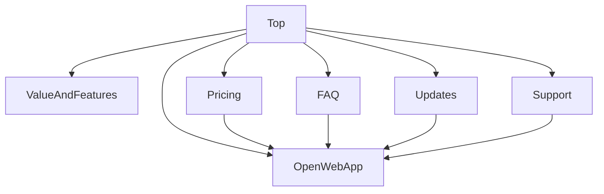

# 公開サイト仕様書

**作成日:** 2026-03-07  
**ステータス:** Draft  
**目的:** Zedi の公開サイトについて、参考サイト調査結果を踏まえた情報設計・採用ページ・責務分離・推奨ディレクトリ構造を定義する。本ドキュメントは実装タスクではなく、公開面改善の仕様上の正本とする。

---

## 目次

1. [概要](#1-概要)
2. [背景](#2-背景)
3. [スコープ](#3-スコープ)
4. [参考サイト調査結果](#4-参考サイト調査結果)
5. [現在の Zedi 公開面整理](#5-現在の-zedi-公開面整理)
6. [採用ページ方針](#6-採用ページ方針)
7. [情報設計とナビゲーション方針](#7-情報設計とナビゲーション方針)
8. [ページ別要件](#8-ページ別要件)
9. [CTA と認証導線](#9-cta-と認証導線)
10. [責務分離方針](#10-責務分離方針)
11. [推奨ディレクトリ構造](#11-推奨ディレクトリ構造)
12. [コンテンツ・i18n・SEO 方針](#12-コンテンツi18nseo-方針)
13. [非スコープ](#13-非スコープ)
14. [関連ドキュメント](#14-関連ドキュメント)

---

## 1. 概要

Zedi は「Zero-Friction Knowledge Network」を掲げるナレッジアプリであり、現在は Web App を中心に開発中である。今後、アプリの説明、利用価値、開発状況、利用開始方法を公開し、ユーザーが安心して試せる情報導線を整備する必要がある。

本仕様では、参考サイトとして `antigravity.google` を調査し、Zedi に適した公開サイトのページ構成・導線・責務分離を定義する。

---

## 2. 背景

### 2.1 現状の課題

- 公開ページとアプリ本体のルートが同一の `src/App.tsx` に混在している。
- `Landing`, `Pricing`, `Donate`, `SignIn`, `NotFound` が個別実装されており、公開面としての一貫したレイアウトやナビゲーション方針が弱い。
- `notes/discover` や公開ノート閲覧のような「一般公開されるがプロダクト機能そのもの」である画面と、説明用の公開ページが同じ扱いになっている。
- 今後ページが増えるほど、アプリ用 Provider・ルーティング・公開ページの責務が混ざり、保守性が下がる。

### 2.2 本ドキュメントの位置づけ

| ドキュメント                                       | 役割                                             | 本書との関係                                 |
| -------------------------------------------------- | ------------------------------------------------ | -------------------------------------------- |
| `docs/PRD.md`                                      | プロダクト全体のビジョン、対象ユーザー、機能要件 | 本書のメッセージ・対象ユーザー定義の前提     |
| `docs/specs/notes-list-and-discover.md`            | 公開ノート一覧の仕様                             | 本書では `apps/web` に残す公開機能として扱う |
| `docs/specs/feature-availability-by-user-state.md` | ユーザー状態別の利用可否                         | 本書の導線整理・公開範囲判断の参考           |
| `docs/specs/zedi-rearchitecture-spec.md`           | 中長期のアーキテクチャ仕様                       | 本書のディレクトリ構造方針と整合させる       |

---

## 3. スコープ

### 3.1 本書の対象

- 公開サイトとして提供する説明ページの構成
- 採用するページ種別と優先順位
- ページ間ナビゲーションと導線
- `apps/site` と `apps/web` の責務分離
- 公開サイトを前提とした推奨ディレクトリ構造
- コンテンツ、i18n、SEO、更新情報の方針

### 3.2 本書の対象外

- 実際の UI 実装
- 実際のルート移設作業
- デザインカンプの詳細
- API 実装や CMS 導入
- 公開サイト公開後の細かな運用手順

---

## 4. 参考サイト調査結果

### 4.1 参考サイトの構成

調査対象: [Google Antigravity](https://antigravity.google/), [Use Cases](https://antigravity.google/use-cases), [Pricing](https://antigravity.google/pricing), [Download](https://antigravity.google/download), [Docs Home](https://antigravity.google/docs/home), [FAQ](https://antigravity.google/docs/faq), [Support](https://antigravity.google/support), [Blog](https://antigravity.google/blog)

参考サイトはトップページだけでなく、以下のページ群で構成されている。

| ページ    | 主な役割                                         | Zedi への示唆                                |
| --------- | ------------------------------------------------ | -------------------------------------------- |
| トップ    | プロダクトの第一印象、価値提案、更新情報への導線 | すべてを説明しすぎず、要点を絞る             |
| Use Cases | ペルソナ別に価値を説明                           | 対象ユーザーごとの訴求を分けたいとき有効     |
| Pricing   | 利用形態、無料枠、上位プランの見通し             | 料金が未確定でも「利用開始条件」は整理できる |
| Download  | インストール導線、動作要件                       | Web 中心の現時点では不要                     |
| Docs      | 全体像、用語、使い方の整理                       | 将来的なヘルプ/ガイド基盤として有効          |
| FAQ       | 不安・制約・利用条件の説明                       | 開発中プロダクトでは特に重要                 |
| Support   | 外部導線、問い合わせ、コミュニティ               | 信頼性と継続性を補強できる                   |
| Blog      | 更新情報、機能発表                               | 開発中であることをポジティブに見せられる     |

### 4.2 参考サイトから採用すべき設計原則

1. トップページは「全説明ページ」ではなく「入口ページ」にする。
2. 詳細説明は配下ページへ逃がし、役割ごとに責務を分ける。
3. 更新情報と FAQ を公開し、開発中プロダクトでも信頼を積み上げる。
4. 利用導線は 1 本にせず、「まず知る」「試す」「詳しく読む」を分ける。

### 4.3 参考サイトからそのままは採用しない点

- ユースケースの細かな分岐は、Zedi の訴求軸がまだ固まり切っていない段階では増やしすぎない。
- ダウンロードページは、現在の Web App 中心フェーズでは優先度が低い。
- カルーセル中心の構成は、日本語での情報理解・保守性の面から依存しすぎない。

---

## 5. 現在の Zedi 公開面整理

### 5.1 現在の主要ルート

| ルート                       | 種別               | 現在の役割       |
| ---------------------------- | ------------------ | ---------------- |
| `/`                          | 公開説明ページ     | ランディング     |
| `/sign-in/*`                 | 公開導線           | 認証入口         |
| `/auth/callback`             | 公開導線           | 認証コールバック |
| `/pricing`                   | 公開説明ページ     | 料金・プラン説明 |
| `/donate`                    | 公開説明ページ     | 寄付案内         |
| `/notes/discover`            | 公開プロダクト機能 | 公開ノート一覧   |
| `/note/:noteId`              | 公開プロダクト機能 | 公開ノート閲覧   |
| `/note/:noteId/page/:pageId` | 公開プロダクト機能 | 公開ページ閲覧   |
| `/home`                      | アプリ本体         | 個人ページ一覧   |
| `/notes`                     | アプリ本体         | ノート一覧       |
| `/page/:id`                  | アプリ本体         | ページ編集       |
| `/settings/*`                | アプリ本体         | 各種設定         |
| `*`                          | 補助ページ         | 404              |

### 5.2 公開面の分類

現在の公開面は、大きく次の 3 種類に分けられる。

| 分類               | 含まれるもの                                                     | 今後の置き場所                             |
| ------------------ | ---------------------------------------------------------------- | ------------------------------------------ |
| 説明ページ         | `/`, `/pricing`, `/donate`, `404`                                | `apps/site`                                |
| 認証導線           | `/sign-in/*`, `/auth/callback`                                   | 原則 `apps/web` だが公開サイトから導線する |
| 公開プロダクト機能 | `/notes/discover`, `/note/:noteId`, `/note/:noteId/page/:pageId` | `apps/web`                                 |

### 5.3 問題点

- 説明ページと公開プロダクト機能の責務が曖昧で、将来の情報設計変更がしづらい。
- `Landing`, `SignIn`, `Donate`, `NotFound` のレイアウトが揃っていない。
- 公開説明ページで不要なアプリ用コンテキストの影響を受けやすい。

---

## 6. 採用ページ方針

### 6.1 採用するページ

Zedi では、少なくとも以下のページを公開サイトで採用する。

| ページ                    | 優先度 | 採用理由                                         |
| ------------------------- | ------ | ------------------------------------------------ |
| トップ                    | 高     | 第一印象、価値提案、主要導線の起点になるため     |
| 料金 / 提供形態           | 高     | 利用開始条件と今後の見通しを伝えるため           |
| FAQ                       | 高     | 開発中ゆえの不安や制約を解消するため             |
| 更新情報                  | 高     | 開発継続性と信頼性を伝えるため                   |
| サポート / フィードバック | 高     | 問い合わせ・改善要望・コミュニティ導線を持つため |

### 6.2 条件付きで採用するページ

| ページ      | 条件                                     | 判断               |
| ----------- | ---------------------------------------- | ------------------ |
| Use Cases   | 対象ユーザー別メッセージを分けたい場合   | Phase 2 以降で検討 |
| Docs / Help | 使い方説明や概念説明を体系化したい場合   | Phase 2 以降で検討 |
| About       | チーム・運営主体の説明が必要になった場合 | 必要性が出たら追加 |

### 6.3 現段階では採用しないページ

| ページ                     | 理由                                         |
| -------------------------- | -------------------------------------------- |
| Download                   | Web 中心フェーズのため不要                   |
| 細かなプラン比較専用ページ | 課金・制限設計が固まってからでよい           |
| 複数のペルソナ別詳細ページ | 情報が分散しやすく、現時点では運用負荷が高い |

---

## 7. 情報設計とナビゲーション方針

### 7.1 公開サイトの基本導線



### 7.2 推奨グローバルナビゲーション

- Product
- Pricing
- FAQ
- Updates
- Support
- Open App

### 7.3 情報設計原則

1. 公開サイトは「アプリの代替」ではなく「理解と利用開始の入口」とする。
2. 公開ノートや Discover は説明ページではなく、実際のプロダクト体験として `apps/web` に残す。
3. 開発中であることは隠さず、FAQ と Updates で透明性を持って伝える。
4. CTA は「今すぐ使う」「まず見る」「詳しく知る」の 3 系統を意識する。

---

## 8. ページ別要件

### 8.1 トップページ

#### 目的

- Zedi が何のためのアプリかを短時間で理解してもらう
- 対象ユーザーとユースケースを伝える
- `apps/web` の利用開始導線につなぐ

#### 推奨セクション

1. Hero
2. 課題と解決
3. 主要機能
4. 公開ノート / 実例への導線
5. 開発状況
6. FAQ 抜粋
7. CTA

#### 備考

- `Landing.tsx` のような単一ページ構成を引き継ぎつつも、セクションを再利用可能な単位へ分割する前提で設計する。

### 8.2 料金 / 提供形態ページ

#### 目的

- 無料でどこまで使えるか
- 今後の有料化・サポート方針があるか
- 個人利用者にとって始めやすいか

#### 要件

- 価格が未確定の場合でも「現時点の提供形態」を明記する
- 今後変更可能性がある場合は、その旨を明示する
- 料金説明だけでなく「誰向けか」も添える

### 8.3 FAQ

#### 目的

- 開発中アプリとしての不安を先回りして減らす
- サポート問い合わせ前に解決できる情報を出す

#### 主要項目例

- Zedi は何ができるか
- 今は Web 版だけか
- 料金はどうなるか
- データはどう扱われるか
- 公開ノートは誰でも見られるか
- ログインなしで何ができるか

### 8.4 更新情報

#### 目的

- 開発が継続していることを示す
- 新機能や改善を説明する
- 検索流入を増やす

#### 要件

- 一覧ページと詳細ページを持てる構成が望ましい
- 初期は Markdown ベースでもよい

### 8.5 サポート / フィードバック

#### 目的

- ユーザーが問題報告や改善要望を送れるようにする
- GitHub や問い合わせ導線を整理する

#### 要件

- 問い合わせ手段を明記する
- バグ報告と機能要望の導線を分けると望ましい

### 8.6 404

#### 目的

- 迷子状態から適切に復帰させる

#### 要件

- トップページへの導線を出す
- 必要に応じて FAQ や公開ノートへの導線を補助的に持たせる

---

## 9. CTA と認証導線

### 9.1 主 CTA

- アプリを使う
- サインインする

### 9.2 副 CTA

- 公開ノートを見る
- 料金を見る
- FAQ を見る

### 9.3 導線方針

- 公開サイトの CTA は最終的に `apps/web` の認証・利用導線へ接続する。
- `SignIn` は公開サイトの一部として独立させるよりも、アプリ利用導線の入口として `apps/web` 側に置く。
- `Use without sign in` のような導線は、実際の利用可否仕様と齟齬が出ないよう `feature-availability-by-user-state.md` と整合させる。

---

## 10. 責務分離方針

### 10.1 `apps/site` に置くもの

- トップ
- 料金 / 提供形態
- FAQ
- 更新情報
- サポート
- 将来的な Use Cases / Docs

### 10.2 `apps/web` に残すもの

- サインイン
- 認証コールバック
- 公開ノート一覧
- 公開ノート閲覧
- アプリ本体すべて

### 10.3 分離原則

| 原則                   | 説明                                               |
| ---------------------- | -------------------------------------------------- |
| 説明責務は `apps/site` | SEO・情報整理・メッセージ改善を主目的とするページ  |
| 利用体験は `apps/web`  | 実データを扱い、ユーザーが実際に使う画面           |
| 共有は最小限           | 共有 UI や型は必要最小限の `packages/*` に限定する |

---

## 11. 提案される将来のディレクトリ構造（target-state）

この節は現在のリポジトリ構成ではなく、公開サイトを分離する場合の target-state を示す。現行の `admin/`、`server/`、`terraform/` などの配置とは異なる将来案として読むこと。

### 11.1 リポジトリ全体

```text
zedi/
├── apps/
│   ├── site/
│   ├── web/
│   └── admin/
├── services/
│   ├── api/
│   └── realtime/
├── packages/
│   ├── api-contracts/
│   ├── ui/
│   └── config/
├── docs/
└── infra/
```

### 11.2 `apps/site` の推奨構成

```text
apps/site/
└── src/
    ├── app/
    │   ├── router/
    │   ├── providers/
    │   └── layout/
    ├── features/
    │   └── public/
    │       ├── pages/
    │       ├── sections/
    │       └── components/
    └── shared/
        ├── ui/
        ├── lib/
        ├── i18n/
        └── assets/
```

### 11.3 `apps/web` の推奨構成

```text
apps/web/
└── src/
    ├── app/
    ├── features/
    │   ├── auth/
    │   ├── notes/
    │   ├── pages/
    │   ├── editor/
    │   ├── search/
    │   └── settings/
    └── shared/
```

---

## 12. コンテンツ・i18n・SEO 方針

### 12.1 コンテンツ方針

- 誇張よりも、現在できることと今後の方針を明確に伝える。
- PRD にある価値提案をベースにしつつ、公開サイトではユーザー価値に翻訳して表現する。
- 更新情報や FAQ によって「開発中」を不安材料ではなく透明性として見せる。

### 12.2 i18n 方針

- 公開サイト専用の名前空間を持つ。
- ページ単位よりも、`public`, `pricing`, `faq`, `updates`, `support` のような責務単位で分ける。
- 既存の `landing`, `pricing`, `donate` などの分散状態は将来的に整理対象とする。

### 12.3 SEO / OGP 方針

- 各ページに固有の title / description を持たせる。
- 更新情報は一覧と詳細ページの双方でインデックス可能にする。
- 公開ノートは `apps/web` 側の SEO 戦略として別途管理する。

---

## 13. 非スコープ

- 公開ノート閲覧機能そのものの仕様変更
- サインインフロー自体の再設計
- 価格体系の最終決定
- CMS の採用可否
- ブログ投稿運用フローの詳細

---

## 14. 関連ドキュメント

- `docs/PRD.md`
- `docs/specs/notes-list-and-discover.md`
- `docs/specs/feature-availability-by-user-state.md`
- `docs/specs/zedi-rearchitecture-spec.md`
- `docs/specs/admin-base-spec.md`
